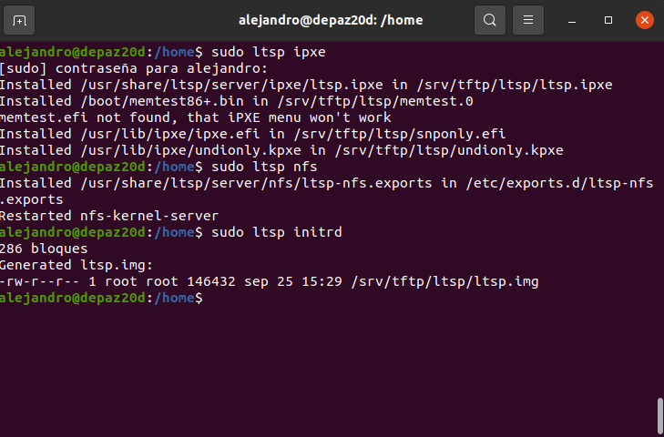

# 1. Clientes ligeros con LTSP/Ubuntu

En esta práctica, vamos a crear una máquina con Ubuntu 20.04.5 e instalaremos y configuraremos un servidor LTSP para que proporcione una imagen de disco Ubuntu 20.04.5 a las máquinas clientes mediante red interna. En otras palabras, vamos a crear un entorno de clientes ligeros, esto es, máquinas cliente que se gestionan a través de una máquina servidor y cuyos datos y aplicaciones están alamacenadas en dicho servidor, de manera que no necesitan un disco duro o cualquier tipo de almacenamiento, simplemente necesitan estar conectados a la red del servidor. Esto facilita el manejo de la información, la realización de backups, hace que los costos administrativos sean menores, entre muchas otras ventajas.

# 2. Servidor LTSP

## 2.1 Preparar la MV Server

Lo primero es crear la MV que hará de servidor. Necesitamos una máquina con 2 interfaces de red, configuradas de la siguiente manera:

* La 1º interfaz será la externa:
    * para comunicarse con Internet.
    * Configurarla en VBox como adaptador puente.
* La 2º interfaz será la interna
    * para conectarse con los clientes ligeros.
    * La IP de esta interfaz de red debe ser estática y debe estar en la misma red que los clientes
        * IP 192.168.67.1
        * Máscara de clase C
        * NO necesita puerta de enlace
    * Configurarla en VBox como "red interna".

    

## 2.2 Instalación del SSOO

A continuación, instalamos un SO GNU/Linux, en este caso Ubuntu 20.04.5. 

* Establecemos la configuración inicial:

   
   


* Creamos los siguientes usuarios locales: `depaz1` y `depaz2`. Comprobamos que podemos entrar al servidor con ambos usuarios y que se ha creado su directorio home:

   


## 2.3 Instalar el servicio LTSP

**Instalamos paquetes**
* Consultar la documentación para el SO elegido.
* En el caso de Ubuntu instalamos lo siguente:
```
apt install --install-recommends ltsp ipxe dnsmasq nfs-kernel-server
openssh-server squashfs-tools ethtool net-tools epoptes
```

   

* Una vez instalados los paquetes, ejecutamos lo siguiente para añadir a los usuarios `alejandro` y `root` al grupo de administradores de epoptes:

```
gpasswd -a nombre-administrador epoptes
```
* También debemos ejecutar lo siguiente, para eliminar el problema de dnsmasq que nos informa de que el puerto 53 ya está en uso. Una vez hecho esto, el servicio dnsmasq estará activo.

```
ltsp dnsmasq --proxy-dhcp=0
```

  

## 3.5 Configuraciones

**Creamos una imagen del SO** que se cargará en la memoria de los clientes ligeros cuando se inicien.
* `time ltsp image`, para crear una imagen de 64 bits del SO. Usamos `time` sólo para medir el tiempo que va a tardar esta operación.
  
  

* Ejecutar `ltsp info`, para consultar información. Vemos que la imagen se ha creado correctamente.

  

**iPXE**: Después de crear la imagen inicial ejecutar el comando siguiente para generar el menú iPXE y copiar los archivos binarios iPXE en TFTP: `ltsp ipxe`

**NFS Server**: Para configurar el servidor LTSP para servir imágenes a través de NFS ejecuta: `ltsp nfs`

**Generar ltsp.img**: `ltsp initrd`

  

# 4. Preparar MV Cliente

* Creamos la MV cliente1 en VirtualBox con la siguiente configuración:
    * Sin disco duro y sin unidad de DVD.
    * Sólo tiene RAM, floppy.
    * Tarjeta de red PXE en modo "red interna".
    * Configurar memoria gráfica a 128MB y habilitar el soporte 3D.
* Con el servidor encendido, iniciar la MV cliente1 desde red/PXE:
    * Comprobar que todo funciona correctamente.
    * Si la tarjeta de red no inicia correctamente el protocolo PXE,
    conectar disquete Etherboot en la disquetera, tal y como se indica
    en la documentación de la web de LTSP.

    

Iniciamos la máquina cliente:

   

Creamos una segunda MV Cliente y la iniciamos. En el siguiente enlace se puede ver el funcionamiento de la práctica:

[Enlace a vídeo](https://www.youtube.com/watch?v=be2cAv7GCtQ) 
