```
Nombre      : Alejandro de Paz Hernández

```

---
# Acceso remoto SSH
---
## Introducción

SSH es el nombre del protocolo y del programa que nos permite acceder de forma remota a una máquina por medio de un canal seguro en el que toda la información está cifrada. También permite copiar datos de forma segura, gestionar claves RSA y, en general, pasar datos y tráfico entre dos máquinas. En esta práctica, vamos a utilizar el SSH en dos entornos servidor-cliente, uno en Winodws y otro en OpenSuse.
---
# 1. Preparativos

Vamos a necesitar las siguientes MVs:

| Función | Sistema Operativo    | IP        | Hostname |
| ------- |--------------------- | --------- | -------- |
| Un servidor SSH | GNU/Linux OpenSUSE | 172.19.20.31 | server20g |
| Un cliente SSH  | GNU/Linux OpenSUSE | 172.19.20.32 | cliente20g |
| Un servidor SSH | Windows Server 2016  | 172.19.20.11 | server20s |
| Un cliente SSH  | Windows            | 172.19.20.12 | cliente20w |

## 1.1 Servidor SSH

* Lo primero es crear nuestra primera máquina servidor con OpenSUSE. Básicamente, instalaremos un OpenSUSE Leap 15.4 sin entorno gráfico. Configuramos una IP estática (podemos usar yast aunque no tengamos entorno gráfico ejecutando `yast2`) y comprobamos:

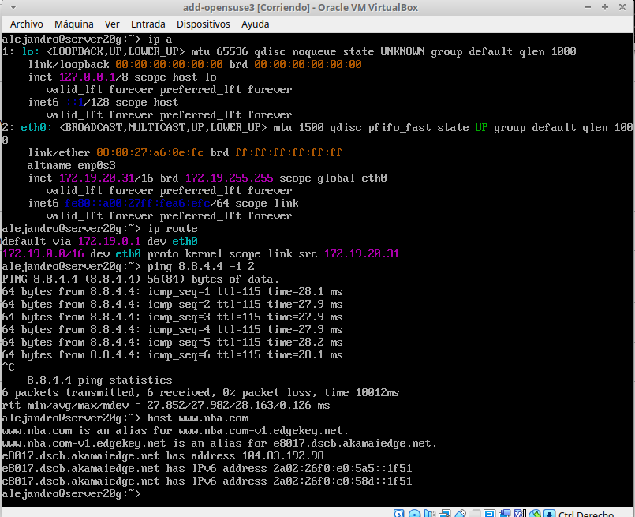

* Añadimos en `/etc/hosts` los equipos `client20g` y `cliente20w` para no tener que escribir la IP completa cada vez que queremos conectarnos o realizar un ping a la máquina remota.

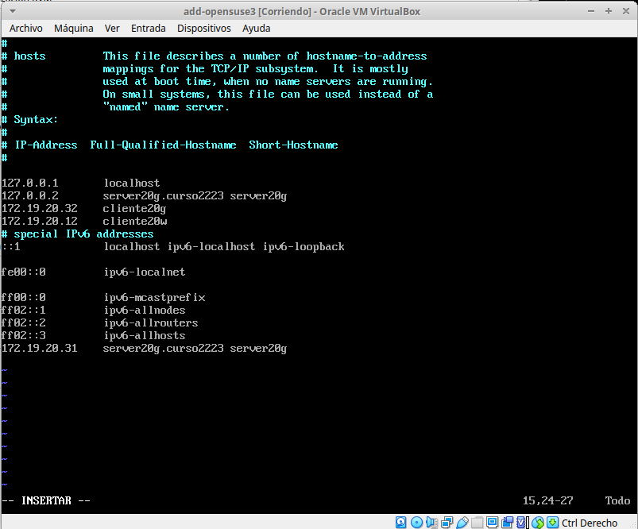

* Antes de comprobar la conexión con la máquina Windows, tendremos que habilitar el recibo de paquetes ICMPv4 en el firewall en Windows:

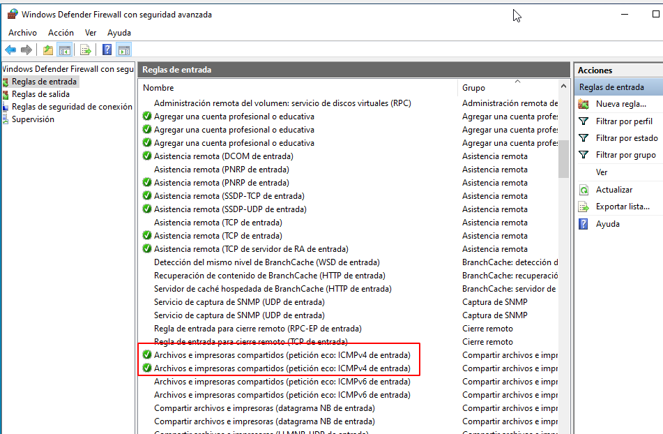

* Ahora sí, comprobamos con un ping que la conexión funciona tanto en el cliente OpenSUSE como en el cliente Windows:

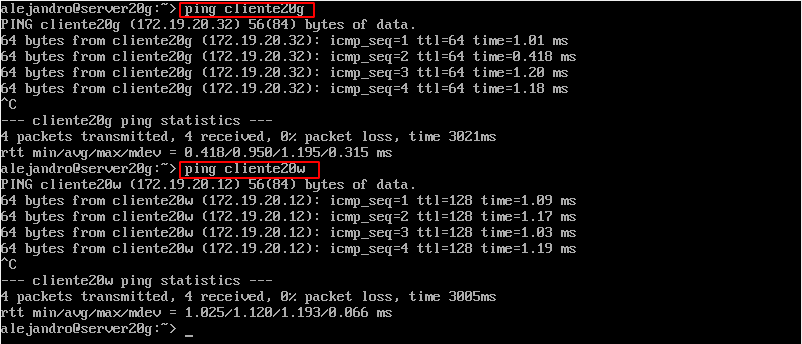

* Creamos los siguientes usuarios en `server20g` y le añadimos una contraseña a cada usuario:


## 1.2 Cliente GNU/Linux

* Nos vamos a nuestra máquina cliente de OpenSUSE (la hemos creado con una configuración básica y con entorno gráfico) y añadimos en `/etc/hosts` los equipos server20g, y cliente20w. Una vez hecho esto, comprobamos la conexión a ambos equipos:

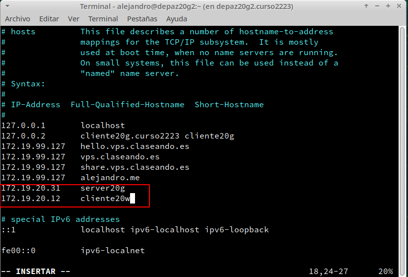

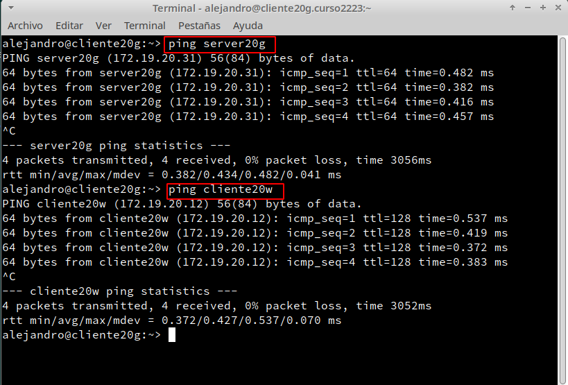

## 1.3 Cliente Windows

* En Windows, tendremos que instalar un cliente SSH ya que no tenemos uno por defecto. En este caso, utilizaremos PuTTy. Nos vamos a la página oficial y lo descargarmos e instalamos.


* Al igual que en las otras máquinas, añadimos en `C:\Windows\System32\drivers\etc\hosts` los equipos server20g y cliente20g y comprobamos la conexión con `ping`:

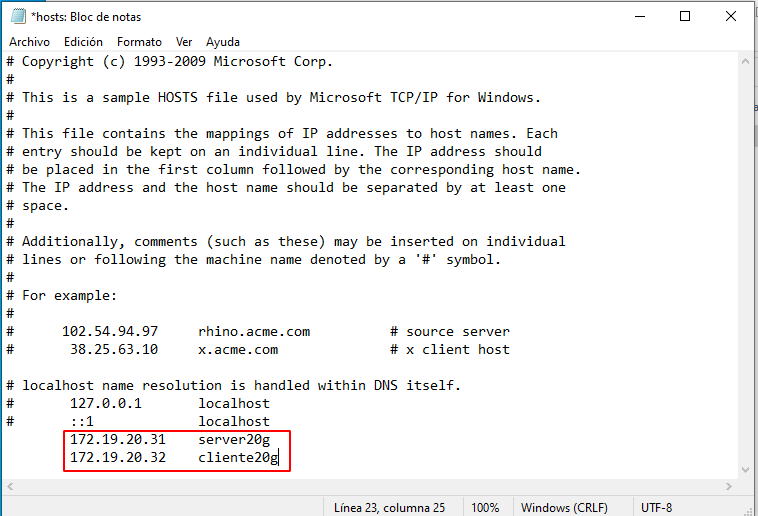

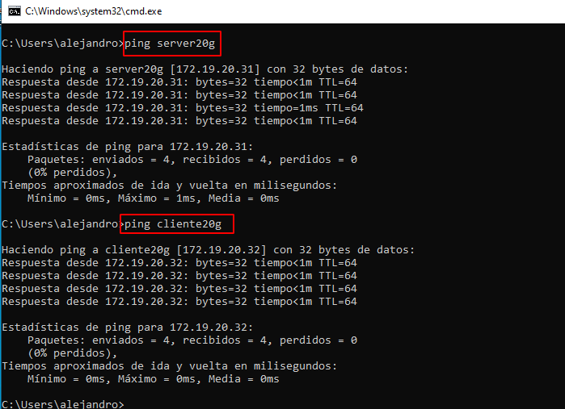


---
# 2 Instalación del servicio SSH en GNU/Linux

* En OpenSUSE tendremos el SSH instalado por defecto (si lo hemos seleccionado en la instalación del sistema). En caso contrario ejectuamos `sudo zypper install openssh`. Comprobamos que el servicio está activo:

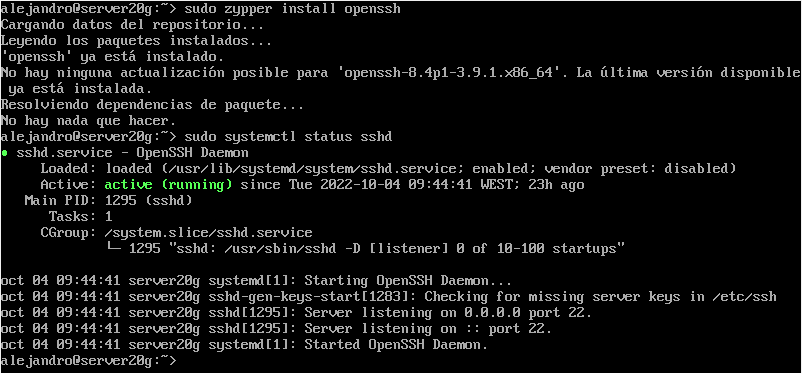

> Para activar el servicio, si no lo estuviera ejecutamos `systemctl enable sshd`.

* Ejecutamos `sudo lsof -i:22 -Pn` para comprobar que el servicio está escuchando por el puerto 22.

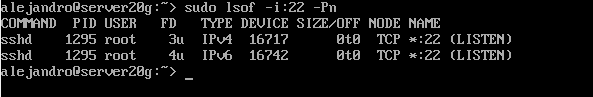

## 2.1 Primera conexión SSH desde cliente GNU/Linux

* Vamos al cliente `cliente20g`.
* `ping server20g`, para comprobar la conectividad con el servidor.
* `nmap -Pn server20g`, para comprobar los puertos abiertos en el servidor (SSH debe estar en estado `open`).

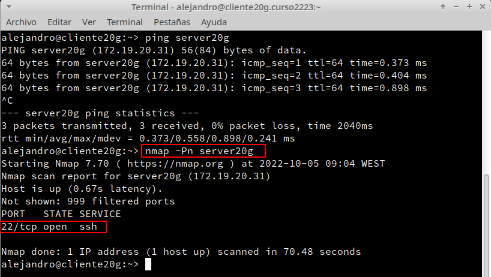


Vamos a comprobar el funcionamiento de la conexión SSH desde cada cliente usando el usuario *depaz1*.
* Desde el cliente GNU/Linux nos conectamos mediante `ssh depaz1@server20g`. 

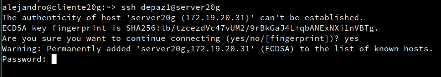

Vemos que en esta primera conexión, se añade al server20g como un host conocido. Si vamos ahora a `$HOME/.ssh/known_hosts` en el equipo cliente, vemos que la clave que aparece es la clave pública del servidor por lo que en el resto de conexiones al server20g no nos volverá a pedir confirmación

* Comprobamos lo anterior realizando la conexión nuevamente. Vemos que ahora solo nos pedirá la contraseña del usuario.

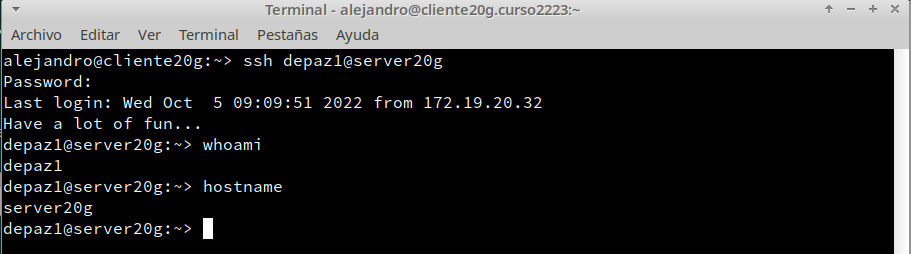

## 2.2 Primera conexión SSH desde cliente Windows

* Desde el cliente Windows (usando `PuTTY`) nos conectamos al servidor SSH de GNU/Linux. 
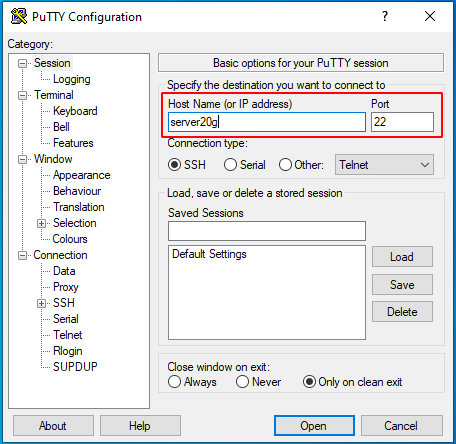

* Al igual que en el cliente OpenSUSE, se producirá un intercambio de claves y se añadirá al server20g como host conocido:

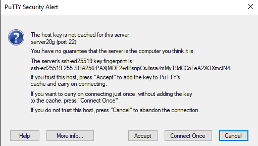

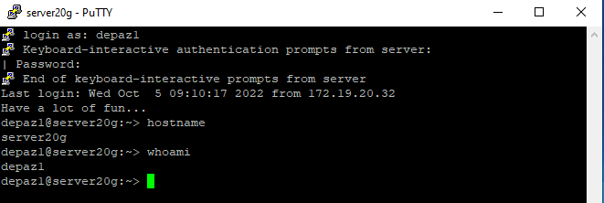

---
# 3. Cambiamos la identidad del servidor

Vamos a ver qué ocurre si cambiamos la clave pública del server20g. Es decir, vamos a cambiar la clave pública que las otras máquinas están guardando en sus ficheros de *known_hosts*.

* Los ficheros `ssh_host*key` y `ssh_host*key.pub`, son ficheros de clave pública/privada
que identifican a nuestro servidor frente a nuestros clientes. Confirmamos que existen en `/etc/ssh` dentro de server20g:

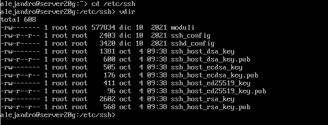

* Vamos a modificar el fichero de configuración SSH (`/etc/ssh/sshd_config`) para dejar una única línea: `HostKey /etc/ssh/ssh_host_rsa_key`. Comentamos el resto de líneas con configuración HostKey. Este parámetro define los ficheros de clave publica/privada que van a identificar a nuestro servidor. Con este cambio decimos que sólo se van a utilizar las claves del tipo RSA.

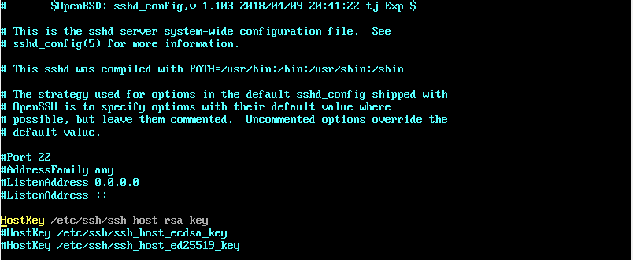

## 3.1 Regenerar certificados

Una vez editado el fichero de configuración, generamos nuevas claves públicas/privadas que identifican nuestro servidor con `ssh-keygen -t rsa -f /etc/ssh/ssh_host_rsa_key`.

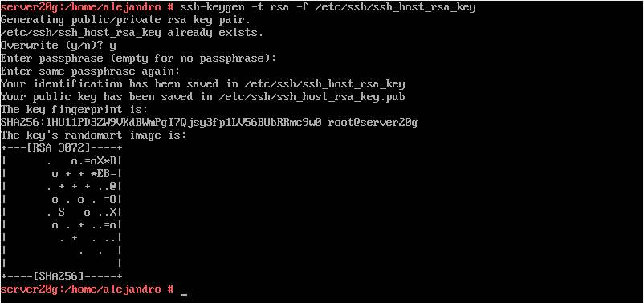

Para que los cambios surtan efecto, reiniciamos el servicio SSH y comprobamos que está en ejecución correctamente:

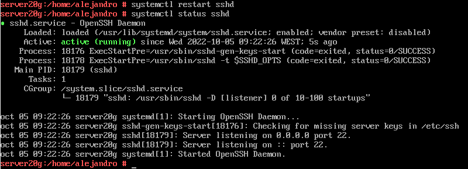

## 3.2 Comprobamos

* Comprobamos que, ahora, al intentar conectarnos por SSH nos salta un error dado que la clave pública ha cambiado. En el propio mensaje de error tenemos la forma de arreglarlo; ejecutar el comando ``ssh-keygen -R server20g -f /home/alejandro/.ssh/known_hosts`. Esto básicamente borra la clave pública que tenemos del server20g para generar una nueva cuando volvamos a realizar la conexión:

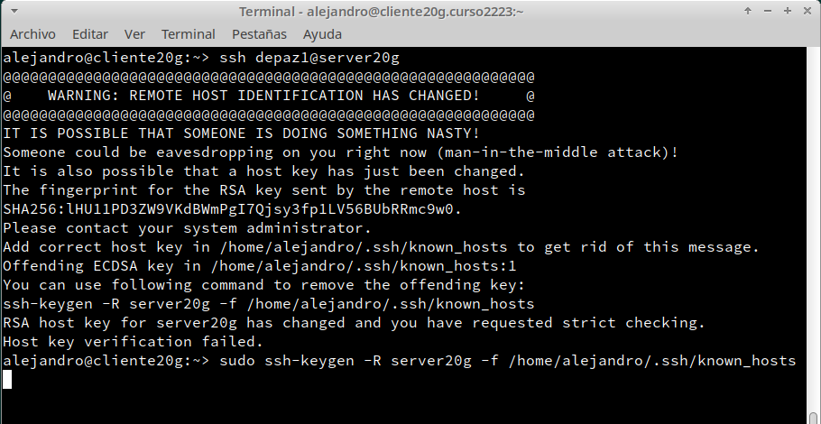

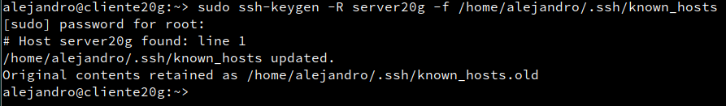

* Si ahora realizamos la conexión de nuevo, añadirá la nueva clave pública al fichero `known_hosts`:

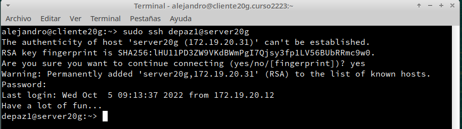

* En Windows, sin embargo, esto se realizará automáticamente. Si tratamos de realiza la conexión nos dirá que la clave pública ha cambiado y nos pedirá permiso para actualizarla.

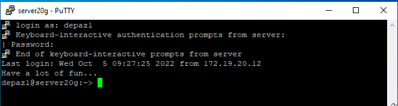

---
# 4. Personalización del prompt Bash

* Podemos personalizar el terminal que nos aparece al realizar el SSH. Por ejemplo, podemos añadir las siguientes líneas al fichero de configuración del usuario `depaz1` en la máquina servidor (Fichero `/home/depaz1/.bashrc`)


* Además, creamos el fichero `/home/depaz1/.alias`, donde pondremos el siguiente contenido. Esto nos permitirá asignar un alias a cada comando para usarlos con mayor comodidad:


* Si ahora accedemos por SSH al servidor con el usuario `depaz1` tendremos lo siguiente:

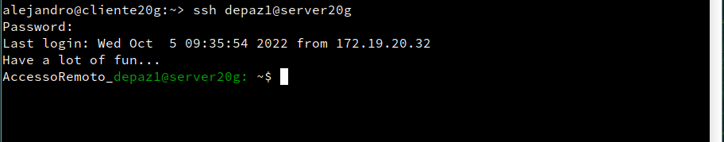

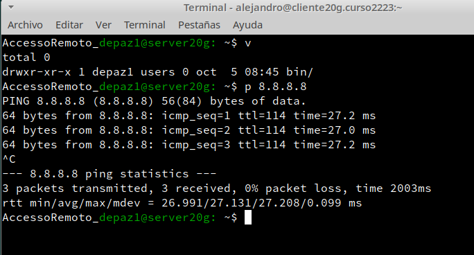

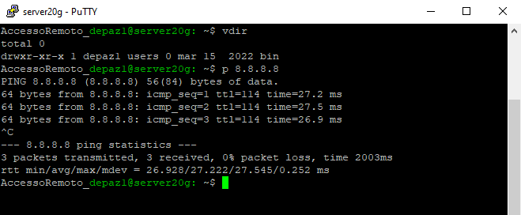

---
# 5. Autenticación mediante claves públicas

**Explicación:**

El objetivo de este apartado es el de configurar SSH para poder acceder desde el `clientXXg` sin necesidad de escribir la clave. Usaremos un par de claves pública/privada.

Para ello, vamos a configurar la autenticación mediante clave pública para acceder con nuestro usuario personal desde el equipo cliente al servidor con el usuario `1er-apellido-alumno4`. Vamos a verlo.

**Práctica**

Capturar imágenes de los siguientes pasos:
* Vamos a la máquina `clientXXg`.
* **¡OJO! No usar el usuario root**.
* Iniciamos sesión con nuestro el usuario **nombre-alumno** de la máquina `clientXXg`.
* `ssh-keygen -t rsa` para generar un nuevo par de claves para el usuario en:
    * `/home/nombre-alumno/.ssh/id_rsa`
    * `/home/nombre-alumno/.ssh/id_rsa.pub`
* Ahora vamos a copiar la clave pública (`id_rsa.pub`), al fichero "authorized_keys" del usuario remoto *1er-apellido-alumno4* que está definido en el servidor. Hay varias formas de hacerlo.
    * El modo recomendado es usando el comando `ssh-copy-id`. Ejemplo para copiar la clave pública del usuario actual al usuario remoto en la máquina remota: `ssh-copy-id 1er-apellido-alumno4@serverXXg`.

> Otra forma de hacerlo sería usando el programa de copia segura `scp`.
>
> * Comprobar que existe el directorio `/home/1er-apellido-alumno4/.ssh` en el servidor.
> * Copiamos el fichero `.ssh/id_rsa.pub` local al fichero `.ssh/authorized_keys` del usuario remoto en la máquina remota.

* Comprobar que ahora al acceder remotamente vía SSH
    * Desde `clientXXg`, NO se pide password.
    * Desde `clientXXw`, SI se pide el password.

---
# 6. Uso de SSH como túnel para X


> Enlaces de interés:
>
> * http://dustwell.com/how-x-over-ssh-really-works.html
> * http://www.vanemery.com/Linux/XoverSSH/X-over-SSH2.html

* Instalar en el servidor una aplicación de entorno gráfico (APP1) que no esté en los clientes. Por ejemplo Geany. Si estuviera en el cliente entonces buscar otra aplicación o desinstalarla en el cliente.
* Modificar servidor SSH para permitir la ejecución de aplicaciones gráficas, desde los clientes. Consultar fichero de configuración `/etc/ssh/sshd_config` (Opción `X11Forwarding yes`)
* Reiniciar el servicio SSH para que se lean los cambios de configuración.

Vamos a clientXXg.
* `zypper se geany`,comprobar que no está instalado el programa.
* Vamos a comprobar desde clientXXg, que funciona "geany" (del servidor).
    * `ssh -X primer-apellido-alumno1@serverXXg`, nos conectamos de forma remota al servidor, y ahora ejecutamos "geany" de forma remota.
    * **¡OJO!** El parámetro es `-X` en mayúsculas, no minúsculas.

---
# 7. Aplicaciones Windows nativas

Podemos tener aplicaciones Windows nativas instaladas en ssh-server mediante el emulador WINE.
* Instalar emulador Wine en el `serverXXg`.
* Ahora podríamos instalar alguna aplicación de Windows en el servidor SSH usando el emulador Wine. O podemos usar el Block de Notas que viene con Wine: wine notepad.
* Comprobar el funcionamiento del programa en serverXXg.
* Comprobar funcionamiento del programa, accediendo desde clientXXg.

> En este caso hemos conseguido implementar una solución similar a RemoteApps usando SSH.

---
# 8. Restricciones de uso

Vamos a modificar los usuarios del servidor SSH para añadir algunas restricciones de uso del servicio.

## 8.1 Restricción sobre un usuario

Vamos a crear una restricción de uso del SSH para un usuario:

* En el servidor tenemos el usuario `primer-apellido2`. Desde local en el servidor podemos usar sin problemas el usuario.
* Vamos a modificar SSH de modo que al usar el usuario por SSH desde los clientes tendremos permiso denegado.

Capturar imagen de los siguientes pasos:
* Consultar/modificar fichero de configuración del servidor SSH (`/etc/ssh/sshd_config`) para restringir el acceso a determinados usuarios. Consultar las opciones `AllowUsers`, `DenyUsers` (Más información en: `man sshd_config`)
* `/usr/sbin/sshd -t; echo $?`, comprobar si la sintaxis del fichero de configuración del servicio SSH es correcta (Respuesta 0 => OK, 1 => ERROR).
* Comprobarlo la restricción al acceder desde los clientes.

## 8.2 Restricción sobre una aplicación

Vamos a crear una restricción de permisos sobre determinadas aplicaciones.

* Crear grupo `remoteapps`
* Incluir al usuario `1er-apellido-alumno4` en el grupo `remoteapps`.
* Localizar un programa (Por ejemplo "geany"). Posiblemente tenga permisos 755.
* Poner al programa el grupo propietario "remoteapps".
* Poner los permisos del ejecutable del programa a 750. Para impedir que los usuarios que no pertenezcan al grupo puedan ejecutar el programa.
* Comprobamos el funcionamiento en el servidor en local.
* Comprobamos el funcionamiento desde el cliente en remoto (Recordar `ssh -X ...`).

---
# 9. Servidor SSH en Windows

* Configurar el servidor Windows con los siguientes valores:
    * SO Windows Server
    * Nombre de equipo: `serverXXs`
    * [Configuración de las MV's](../../global/configuracion/windows-server.md)
* Añadir en `C:\Windows\System32\drivers\etc\hosts` el equipo clientXXg y clientXXw.
* Comprobar haciendo ping a ambos equipos.
* [Instalar y configurar el servidor SSH en Windows](../../global/acceso-remoto/windows-ssh.md).
    * Elegir la opción que se quiera: OpenSSH o integrado.
    * Documentar el proceso de instalación y configuración.
* Comprobar acceso SSH desde los clientes Windows y GNU/Linux al servidor SSH Windows.
    * `netstat -n` en Windows.
    * `lsof -i -nP` en GNU/Linux.

> Enlaces de interés:
>
> * [Vídeo: Instalación y configuración de un servidor SSH en Windows Server](http://www.youtube.com/embed/QlqokjKt69I)

# 10. Extras: otras aplicaciones relacionadas

## 10.1 ClusterSSH

Es una herramienta para hacer múltiples conexiones remotas SSH en paralelo. Facilita trabajar con muchas máquinas al mismo tiempo.

> Enlace de interés:
> * https://www.putorius.net/cluster-ssh.html

* Trabajaremos en grupos de 2.
* Crear usuario `invitadoAABB` en todas las máquinas.
    * Donde AA es el id del alumno 01
    * Donde BB es el id del alumno 02
* Instalar ClusterSSH en la máquina que servirá de controlador.
* Aplicar algún cambio masivo usando `cssh`.

## 10.1 Netcat

> Enlaces de interés:
> * [Usos del comando ncat cpn ejemplos](https://www.ochobitshacenunbyte.com/2021/11/04/uso-del-comando-ncat-nc-en-linux-con-ejemplos/)

* Trabajaremos en grupos de 2.
* Instalar NetCat en 2 máquinas diferentes.
* Invocar nc con los parámetros adecuados para establecer conexión remota.

---

# ANEXO A

# Setup Passwordless SSH Login for Multiple Remote Servers Using Script

https://www.tecmint.com/passwordless-ssh-login-for-multiple-remote-servers/

## SSH cipher

https://answers.launchpad.net/ubuntu/+source/openssh/+question/669164

## Túnel Inverso SSH - mundohackers

* [Cómo hacer un túnel inverso SSH](https://mundo-hackers.weebly.com/tuacutenel-inverso-ssh.html#)
* [Un bruto con Debian: Tunel inverso SSH](https://unbrutocondebian.blogspot.com/2013/08/tunel-inverso-ssh.html?m=1)

## Trabajo colaborativo usando SSH

Podemos seguir esta recomendación para que varias personas trabajen en la misma máquina.

Supongamos que tenemos 2 máquinas llamadas MV1 y MV2.
* En MV1 instalamos el servidor SSH.
* En MV1 tenemos los usuarios usu1 y usu2.
* Desde MV2 para conectarse a MV1 debemos hacer: ssh usu2@ip-mv1. Con esto abrimos sesión en MV1 desde MV2 y podemos trabajar desde MV2.

Si queremos abrir una sesión remota pero gráfica podemos hacer en MV2:
* ssh -X usu2@ip-mv1 (Es es para abrir la sesión. Establecer contacto)
* nautilus (Con esto abrimos un explorador en MV1 pero desde MV2)
* Si tenemos el programa LibreOffice instalado en MV1, pero no en MV2... podemos conectarnos con ssh -X, y luego ejecutar... /usr/lib/libreoffice/program/soffice.bin, y ya está. Esto es trabajo remoto.

Si queremos copiar archivo de MV2 hacia MV1 hacemos:
* scp file usu2@ip-m1:/home/usu2, Ya está!
* Si además queremos iniciar una sesión sftp hacemos: sftp usu2@ip-m1