```
Nombre      : Alejandro de Paz Hernández

```

---
# Acceso remoto SSH
---
## Introducción

SSH es el nombre del protocolo y del programa que nos permite acceder de forma remota a una máquina por medio de un canal seguro en el que toda la información está cifrada. También permite copiar datos de forma segura, gestionar claves RSA y, en general, pasar datos y tráfico entre dos máquinas. En esta práctica, vamos a utilizar el SSH en dos entornos servidor-cliente, uno en Winodws y otro en OpenSuse.

---
# 1. Preparativos

Vamos a necesitar las siguientes MVs:

| Función | Sistema Operativo    | IP        | Hostname |
| ------- |--------------------- | --------- | -------- |
| Un servidor SSH | GNU/Linux OpenSUSE | 172.19.20.31 | server20g |
| Un cliente SSH  | GNU/Linux OpenSUSE | 172.19.20.32 | cliente20g |
| Un servidor SSH | Windows Server 2016  | 172.19.20.11 | server20s |
| Un cliente SSH  | Windows            | 172.19.20.12 | cliente20w |

## 1.1 Servidor SSH

* Lo primero es crear nuestra primera máquina servidor con OpenSUSE. Básicamente, instalaremos un OpenSUSE Leap 15.4 sin entorno gráfico. Configuramos una IP estática (podemos usar yast aunque no tengamos entorno gráfico ejecutando `yast2`) y comprobamos:

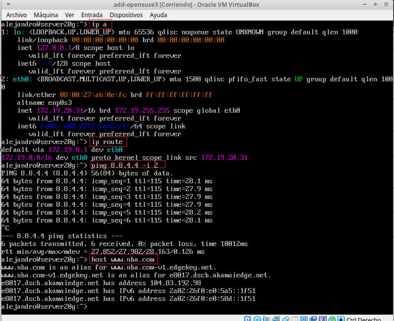

* Añadimos en `/etc/hosts` los equipos `client20g` y `cliente20w` para no tener que escribir la IP completa cada vez que queremos conectarnos o realizar un ping a la máquina remota.


* Antes de comprobar la conexión con la máquina Windows, tendremos que habilitar el recibo de paquetes ICMPv4 en el firewall en Windows:


* Ahora sí, comprobamos con un ping que la conexión funciona tanto en el cliente OpenSUSE como en el cliente Windows:


* Creamos los siguientes usuarios en `server20g` y le añadimos una contraseña a cada usuario:


## 1.2 Cliente GNU/Linux

* Nos vamos a nuestra máquina cliente de OpenSUSE (la hemos creado con una configuración básica y con entorno gráfico) y añadimos en `/etc/hosts` los equipos server20g, y cliente20w. Una vez hecho esto, comprobamos la conexión a ambos equipos:


## 1.3 Cliente Windows

* En Windows, tendremos que instalar un cliente SSH ya que no tenemos uno por defecto. En este caso, utilizaremos PuTTy. Nos vamos a la página oficial y lo descargarmos e instalamos.


* Al igual que en las otras máquinas, añadimos en `C:\Windows\System32\drivers\etc\hosts` los equipos server20g y cliente20g y comprobamos la conexión con `ping`:


---
# 2 Instalación del servicio SSH en GNU/Linux

* En OpenSUSE tendremos el SSH instalado por defecto (si lo hemos seleccionado en la instalación del sistema). En caso contrario ejectuamos `sudo zypper install openssh`. Comprobamos que el servicio está activo:


> Para activar el servicio, si no lo estuviera ejecutamos `systemctl enable sshd`.

* Ejecutamos `sudo lsof -i:22 -Pn` para comprobar que el servicio está escuchando por el puerto 22.


## 2.1 Primera conexión SSH desde cliente GNU/Linux

* Vamos al cliente `cliente20g`.
* `ping server20g`, para comprobar la conectividad con el servidor.
* `nmap -Pn server20g`, para comprobar los puertos abiertos en el servidor (SSH debe estar en estado `open`).


Vamos a comprobar el funcionamiento de la conexión SSH desde cada cliente usando el usuario *depaz1*.
* Desde el cliente GNU/Linux nos conectamos mediante `ssh depaz1@server20g`. 


Vemos que en esta primera conexión, se añade al server20g como un host conocido. Si vamos ahora a `$HOME/.ssh/known_hosts` en el equipo cliente, vemos que la clave que aparece es la clave pública del servidor por lo que en el resto de conexiones al server20g no nos volverá a pedir confirmación

* Comprobamos lo anterior realizando la conexión nuevamente. Vemos que ahora solo nos pedirá la contraseña del usuario.


## 2.2 Primera conexión SSH desde cliente Windows

* Desde el cliente Windows (usando `PuTTY`) nos conectamos al servidor SSH de GNU/Linux. 


* Al igual que en el cliente OpenSUSE, se producirá un intercambio de claves y se añadirá al server20g como host conocido:


---
# 3. Cambiamos la identidad del servidor

Vamos a ver qué ocurre si cambiamos la clave pública del server20g. Es decir, vamos a cambiar la clave pública que las otras máquinas están guardando en sus ficheros de *known_hosts*.

* Los ficheros `ssh_host*key` y `ssh_host*key.pub`, son ficheros de clave pública/privada
que identifican a nuestro servidor frente a nuestros clientes. Confirmamos que existen en `/etc/ssh` dentro de server20g:


* Vamos a modificar el fichero de configuración SSH (`/etc/ssh/sshd_config`) para dejar una única línea: `HostKey /etc/ssh/ssh_host_rsa_key`. Comentamos el resto de líneas con configuración HostKey. Este parámetro define los ficheros de clave publica/privada que van a identificar a nuestro servidor. Con este cambio decimos que sólo se van a utilizar las claves del tipo RSA.


## 3.1 Regenerar certificados

Una vez editado el fichero de configuración, generamos nuevas claves públicas/privadas que identifican nuestro servidor con `ssh-keygen -t rsa -f /etc/ssh/ssh_host_rsa_key`.


Para que los cambios surtan efecto, reiniciamos el servicio SSH y comprobamos que está en ejecución correctamente:


## 3.2 Comprobamos

* Comprobamos que, ahora, al intentar conectarnos por SSH nos salta un error dado que la clave pública ha cambiado. En el propio mensaje de error tenemos la forma de arreglarlo; ejecutar el comando `ssh-keygen -R server20g -f /home/alejandro/.ssh/known_hosts`. Esto básicamente borra la clave pública que tenemos del server20g para generar una nueva cuando volvamos a realizar la conexión:


* Si ahora realizamos la conexión de nuevo, añadirá la nueva clave pública al fichero `known_hosts`:


* En Windows, sin embargo, esto se realizará automáticamente. Si tratamos de realiza la conexión nos dirá que la clave pública ha cambiado y nos pedirá permiso para actualizarla.


---
# 4. Personalización del prompt Bash

* Podemos personalizar el terminal que nos aparece al realizar el SSH. Por ejemplo, podemos añadir las siguientes líneas al fichero de configuración del usuario `depaz1` en la máquina servidor (Fichero `/home/depaz1/.bashrc`)

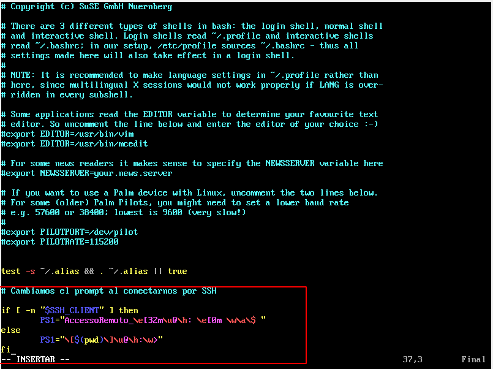

* Además, creamos el fichero `/home/depaz1/.alias`, donde pondremos el siguiente contenido. Esto nos permitirá asignar un alias a cada comando para usarlos con mayor comodidad:


* Si ahora accedemos por SSH al servidor con el usuario `depaz1` tendremos lo siguiente:


---
# 5. Autenticación mediante claves públicas

El objetivo de este apartado es el de configurar SSH para poder acceder desde el `client20g` sin necesidad de escribir la clave. Usaremos un par de claves pública/privada.

Para ello, vamos a configurar la autenticación mediante clave pública para acceder con nuestro usuario personal desde el equipo cliente al servidor con el usuario `depaz4`.

* Iniciamos sesión con el usuario **alejandro** de la máquina `client20g` y ejecutamos `ssh-keygen -t rsa` para generar un nuevo par de claves para el usuario en:`/home/alejandro/.ssh/id_rsa` y `/home/alejandro/.ssh/id_rsa.pub`.

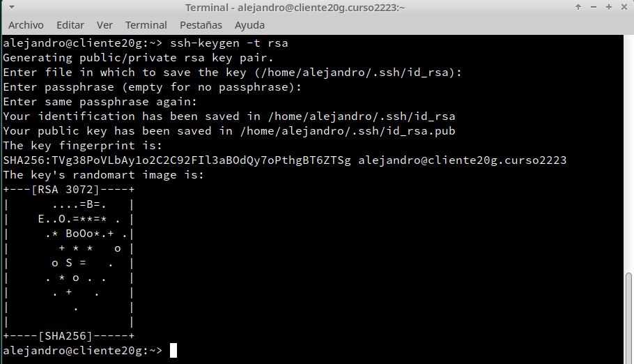

* Ahora vamos a copiar la clave pública (`id_rsa.pub`), al fichero "authorized_keys" del usuario remoto *depaz4* que está definido en el servidor. La forma más fácil y rápida de hacerlo es haciendo `ssh-copy-id depaz4@server20g`.

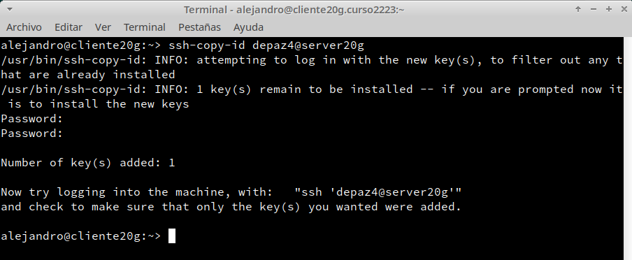

* Comprobamos que ahora al acceder remotamente vía SSH
    * Desde `client20g`, no se pide password con el usuario `depaz4` pero sí con el usuario `depaz1`.

    

    * Desde `client20w`, sí se pide el password con `depaz4`.

    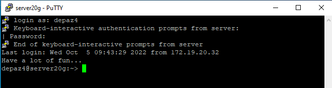

---
# 6. Uso de SSH como túnel para X

Vamos a utilizar el SSH como túnel para ejecutar aplicaciones de forma remota desde el cliente.

* Instalamos en el servidor una aplicación de entorno gráfico que no esté en los clientes, en este caso instalaremos Geany.

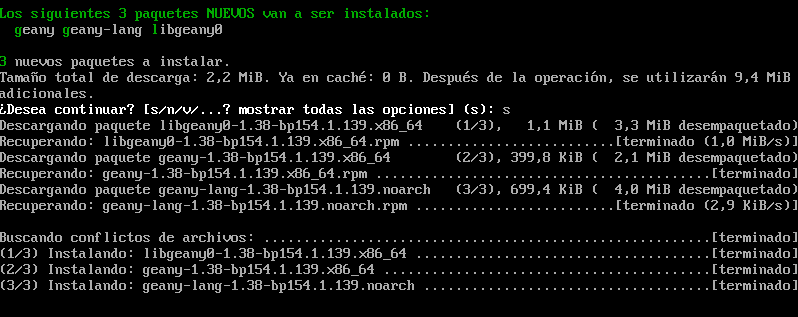

* Modificamos servidor SSH para permitir la ejecución de aplicaciones gráficas desde los clientes. Para ello vamos al fichero de configuración `/etc/ssh/sshd_config` y nos aseguramos de que exista la siguiente línea: `X11Forwarding yes`.


* Reiniciamos el servicio SSH para que se lean los cambios de configuración.

* Vamos a cliente20g y nos conectamos por SSH con el parámetro *-X*, que nos permitirá la ejecución de apliciones: `ssh -X depaz1@server20g`. A continuación, ejecutamos geany.
    
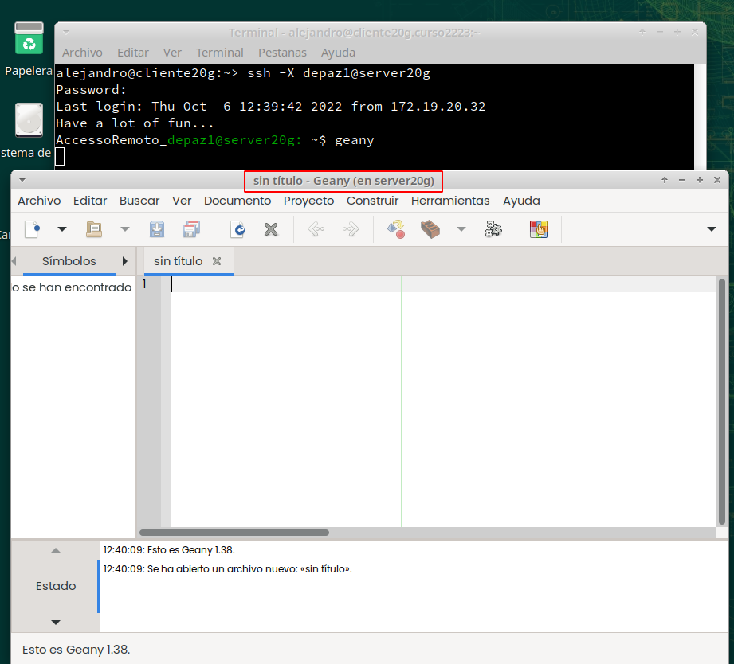

* En caso de que el paso anterior nos de error (*X11Forwarding failed*), es posible que sea debido a no tener instalado XAuth en el servidor, así que lo instalamos:

.png)

* Si lo anterior no funciona, podemos hacer el SSH con el parámetro *-v* añadido para activar el modo debug y ver qué error nos está dando exactamente.

---
# 7. Aplicaciones Windows nativas

Podemos tener aplicaciones Windows nativas instaladas en ssh-server mediante el emulador WINE.
* Instalamos el emulador Wine en el `server20g` y comprobamos su funcionamiento en `cliente20g` con la aplicación NotePad, que viene instalada por defecto con Wine:

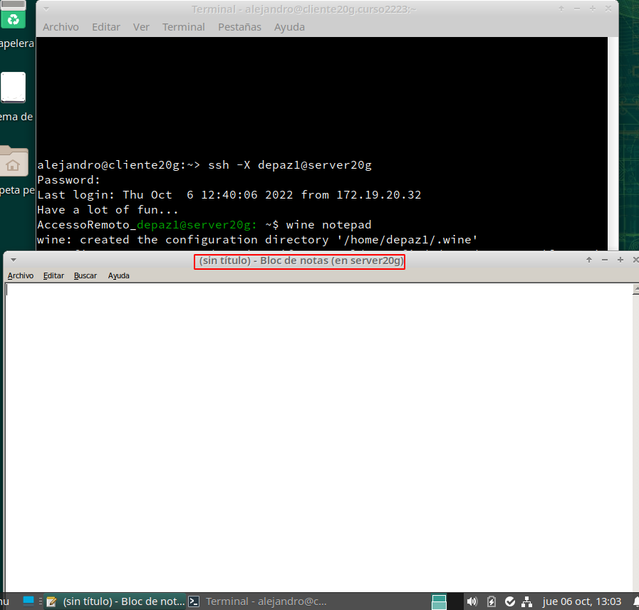

---
# 8. Restricciones de uso

Vamos a modificar los usuarios del servidor SSH para añadir algunas restricciones de uso del servicio.

## 8.1 Restricción sobre un usuario

Vamos a crear una restricción de uso del SSH para un usuario:

* En el servidor tenemos el usuario `depaz2`. Desde el servidor podemos usar sin problemas el usuario, pero vamos a modificar el SSH de modo que al usar el usuario desde los clientes tendremos permiso denegado.

* Modificamos el fichero de configuración del servidor SSH (`/etc/ssh/sshd_config`) para restringir el acceso a determinados usuarios utilizando la sentencia `DenyUsers`:

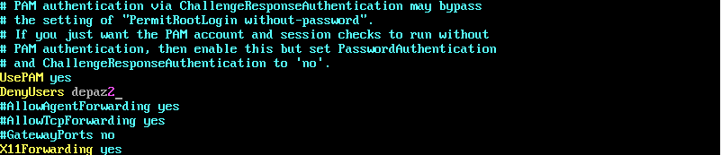

* Compilamos el fichero anterior para comprobar si existe algún error. Si la salida es 0 es que ha ido todo bien.:


* Comprobamos la restricción al acceder desde los clientes:

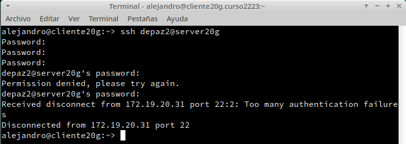


* Vemos que nos deniega el acceso e incluso rechaza la conexión SSH después de muchos intentos de inicio de sesión.

## 8.2 Restricción sobre una aplicación

Vamos a crear una restricción de permisos sobre determinadas aplicaciones.

* Creamos el grupo `remoteapps` e incluimos al usuario `depaz4` en dicho grupo.


* Buscamos la ruta del programa `geany` y hacemos al grupo `remoteapps` propietario del programa. Acto seguido, le damos los permisos 750 al ejecutable para que solo lo puedan ejecutar los usuarios que pertenezcan al grupo `remoteapps`.

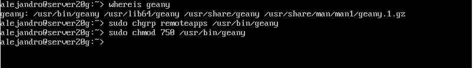


* Desde el servidor no nos dejará ejecutarlo de ninguna forma puesto que no tenemos interfaz gráfica, asi que utilizaremos un cliente. Al entrar con el usuario `depaz1` vemos que no tenemos permiso para ejecutarlo:


* Sin embargo, con el usuario `depaz4` sí que podremos:

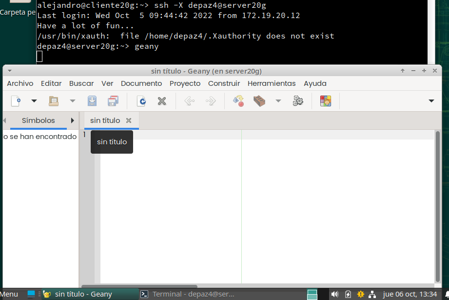

---
# 9. Servidor SSH en Windows

* Para este último apartado utilizaremos una máquina Windows Server 2016 con configuración básica.
* Añadimos en `C:\Windows\System32\drivers\etc\hosts` el equipo client20g y client20w.

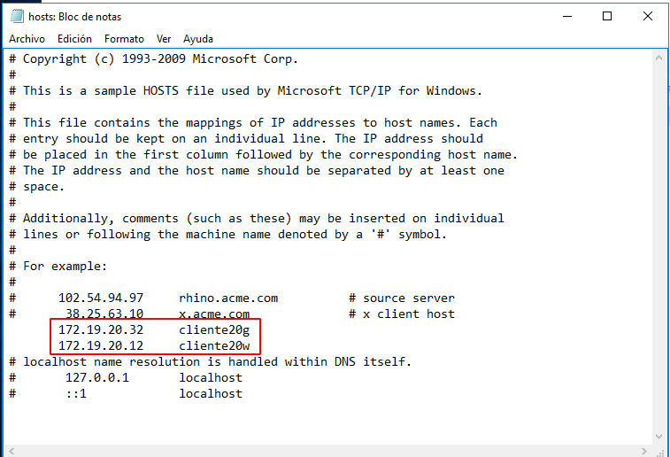

* Ahora tendremos que instalar sl servidor SSH. Para ello existen dos opciones, el integrado o el programa OpenSSH. Instalaremos el segundo, puesto que es más sencillo. Descargamos el .zip desde el GitHub oficial de OpenSSH y, si es la versión de 32 bits la descomprimimos en `Archivos de Programa(x86)`. Si es la versión de 64 bits, en `Archivos de Programa`, aunque esto no debería afectar al funcionamiento del programa. 

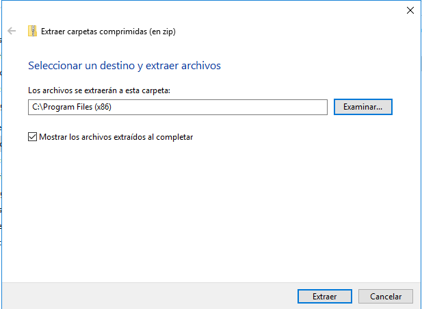

* En caso de que la descarga nos de error, tendremos que habilitarlas en los ajustes del navegador:

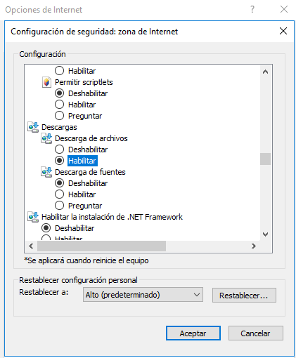

Una vez descomprimido el .zip, tendremos que ir a PowerShell para realizar la instalación. 

* Lo primero es ejecutar el script para instalar los servicios `sshd` y `ssh-agent` y comprobar que todo ha ido bien.

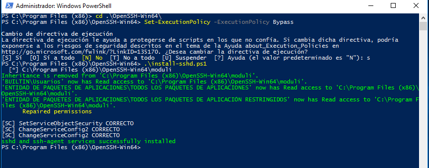

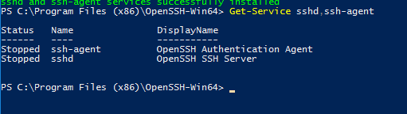

* Generamos las claves del servidor:

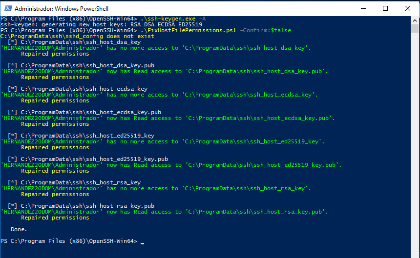

* Habilitamos el SSH en el firewall y configuramos los servicios SSH para que se inicien automáticamente:

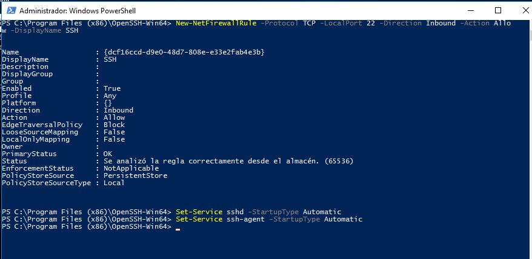

* Ahora podremos acceder de forma remota a la máquina Windows Server. Comprobamos:

    * Desde `cliente20g`:

    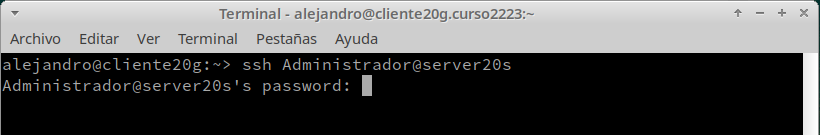

    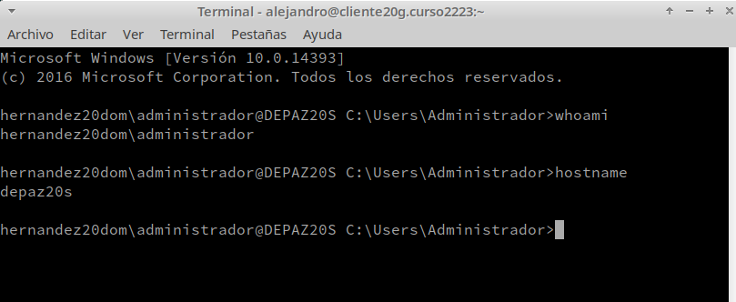

    * Desde `cliente20w`:

    

    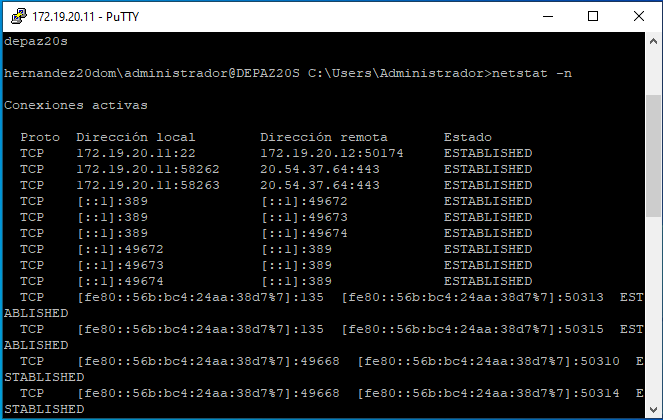