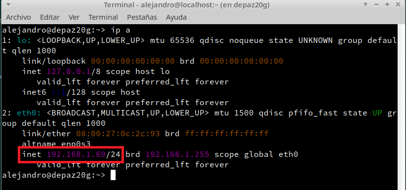
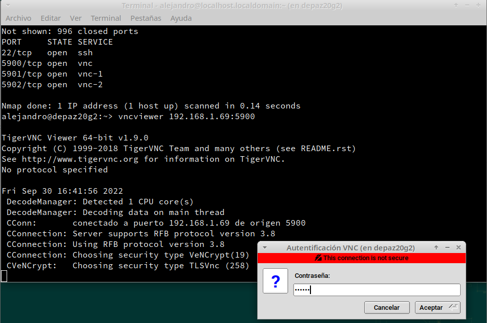

 # 0. Introducción VNC

VNC o Computación Virtual en Red es un software libre que permite crear un entorno cliente-servidor de forma que el cliente pueda ver y controlar la máquina servidor de forma remota. Es posible hacerlo incluso entre máquinas con SSOO distinto, como veremos a continuación. En esta práctica vamos a utilizar 4 máquinas distintas, dos máquinas Windows y dos máquinas OpenSuse. En mi caso, he utilizado dos máquinas reales con Windows 11 y Windows 10 (mi portátil y el sobremesa de un familiar) ya que las máquinas virtuales con Windows iban extremadamente mal en VirtualBox.

## 0.2 Configuraciones

Vamos a montar un entorno como el siguiente: 

| MV | OS       | IP           | Rol        | Detalles              |
| -- | -------- | ------------ | ---------- | --------------------- |
|  1 | Windows 11 | 192.168.1.49 | Slave VNC  | Instalar servidor VNC |
|  2 | Windows 10 | 192.168.1.62 | Master VNC | Instalar cliente VNC  |
|  3 | OpenSUSE | 192.168.1.69 | Slave VNC  | Instalar servidor VNC |
|  4 | OpenSUSE | 192.168.1.71 | Master VNC | Instalar cliente VNC  |

**NOTA: (Las IPs que he utilizado han sido estas ya que he realizado la práctica en casa. Por eso y porque he utilizado máquinas reales, me he saltado las configuraciones de las máquinas Windows y las configuraciones de red de las máquinas OpenSuse)**

# 1. Windows: Slave VNC

* Descargamos `TightVNC` desde la página oficial.
* En el servidor VNC, es decir, la MV Windows 11 instalaremos `TightVNC -> Custom -> Server`. Esto es el servicio.

* Establecemos una contraseña para la conexión remota:

* En caso de errores, revisar el cortafuegos de Windows.

## 1.2 Ir a una máquina con GNU/Linux

* Ejecutamos `nmap -Pn 192.168.1.49`, desde la máquina real para comprobar
que los servicios son visibles desde fuera de la máquina VNC-SERVER. Vemos que VNC está escuchando desde los puertos 5800 y 5900:

# 2 Windows: Master VNC

* En el cliente Windows seguimos los pasos anteriores pero esta vez instalamos `TightVNC -> Custom -> Viewer`.

* Ejecutamos `TightVNC Viewer`, el cliente VNC e introducimos la IP de la máquina que queremos visualizar que, en este caso, es 192.168.1.49

* Vemos que podemos visualizar y manipular la máquina server:

## 2.1 Comprobaciones finales

* Para verificar que se han establecido las conexiones remotas vamos al servidor VNC y utilizamos el comando `netstat -n` para ver las conexiones VNC con el cliente. Vemos que las IPs coinciden y la conexión está en estado ESTABLISHED

# 3. OpenSUSE: Slave VNC

* Establecemos la configuración inicial editando los ficheros `/etc/hosts` y `/etc/hostname` (He saltado la configuración de red y la he dejado en DHCP ya que estoy usando la red de casa):

* Vamos a `Yast -> VNC`
    * Permitimos conexión remota, que configura el servicio `xinet`.
    * Abrimos los puertos VNC en el cortafuegos.

* Ir a `Yast -> Cortafuegos`
    * Revisamos la configuración del cortafuegos.
    * Vemos que están permitidas las conexiones a VNC.

* Con el usuario `alejandro`:
    * Ejecutamos `vncserver` en el servidor para iniciar el servicio VNC.
    * Ponemos claves para las conexiones VNC a nuestro escritorio.
    * Al final se nos muestra el número de nuestro escritorio remoto. Lo utilizaremos más adelante para realizar la conexión.

* `vdir /home/alejandro/.vnc`, vemos que se nos han creado unos ficheros de configuración VNC asociados a nuestro usuario.

* Ejecutamos `ps -ef|grep vnc` para comprobar que los servicios relacionados con vnc están en ejecución.
* Ejecutamos `lsof -i -nP` para comprobar que están los servicios en los puertos VNC (5802 y 5902).

## 3.1 Ir a una máquina GNU/Linux

* Ejecutamos `nmap -Pn 192.168.1.69`, desde una máquina GNU/Linux para comprobar que los servicios son visibles desde fuera de la máquina VNC-SERVER. Deben verse los puertos VNC (5802, 5902, etc).

---

# 4. OpenSUSE: Master VNC
* Realizamos la configuración inicial al igual que en la máquina anterior. El nombre de esta será `depaz20g2` y la configuración de red:

* En OpenSuse `vncviewer` viene instalado por defecto, a diferencia de Windows.
* En la conexión remota, tenemos que especificar el puerto por el que realizaremos la conexión. En nuestro caso será el puerto 5901.
* Hay varias formas de usar vncviewer, nosotros usaremos la primera:
    * `vncviewer IP-vnc-server:590N`
    * `vncviewer IP-vnc-server:N`
    * `vncviewer IP-vnc-server::590N`

## 4.1 Comprobaciones finales

Una vez conectados a la máquina servidor, ejecutamos lo siguiente desde la misma:

* `lsof -i -nP` para comprobar las conexiones VNC.

* `vncserver -list` para ver la lista de sesiones abiertas.

---

# 5. Comprobaciones con SSOO cruzados

A continuación, vamos a comprobar la conexión entre los SSOO de forma cruzada, es decir, de OpenSuse a Windows y de Windows a OpenSuse:

* Conectamos el cliente GNU/Linux con el Servidor VNC Windows.
Usaremos el comando `vncviewer 192.168.1.49` sin especificar puerto alguno.

* Introducimos la contraseña y estaremos dentro de la máquina Windows:

* Ejecutamos `netstat -n` en el servidor Windows para comprobar que, efectivamente, se ha realizado la conexión y que las IPs están correctas. Podemos ver además que la conexión realizada anteriormente entre las máquinas Windows aparece como TIME_WAIT (ha finalizado):

* Conectamos el cliente Windows con el servidor VNC GNU/Linux. En este caso, tendremos que especificar el puerto.

* Ejecutarmos en el servidor GNU/Linux `lsof -i -nP` para comprobar que se ha realizado la conexión (Cabe destacar que al realizar este paso yo ya había realizado el siguiente punto (punto 6) donde activamos el control de la pantalla local):

---

# 6. DISPLAY 0 en GNU/Linux

Cuando queremos ejecutar VNC en GNU/Linux para controlar directamente la pantalla local usaremos el comando `x0vncserver`.
* Vamos a usar las 2 MV GNU/Linux.
* Vamos al servidor y ejectuamos `x0vncserver -display :0 -passwordfile /home/nombre-alumno/.vnc/passwd`. Este comando habilitará el despliegue de la pantalla para el VNC Master, y activará la solicitud la contraseña almacenada en `/home/nombre-alumno/.vnc/passwd`. Vemos además que está utilizando el puerto 5900.

* Vamos al cliente y usamos nmap para comprobar que el puerto 5900 del servidor 
está abierto.

* Probamos a conectarnos con el servidor a través del puerto 5900(`vncviewer 192.168.1.69:5900`).

* Ejecutamos `lsof -i -nP` en el server.

