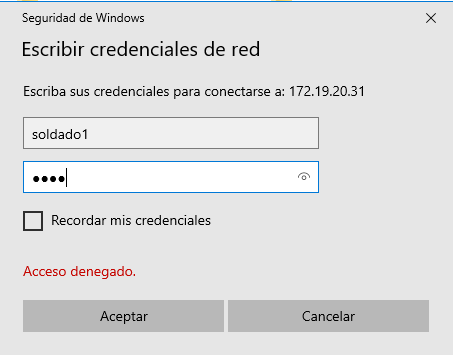
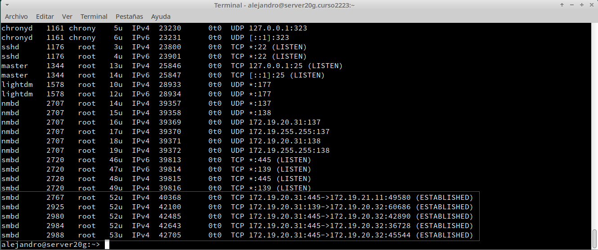

```
Nombre      : Alejandro de Paz Hernández

```

# Samba (con OpenSUSE y Windows)

## Introducción

Samba es una implementación de código abierto del protocolo Server Message Block (SMB). Esto permite la interconexión de redes de diversos sistemas operativos como Windows, Linux, UNIX... permitiendo acceso a archivos e impresoras y haciendo que una máquina pueda actuar a modo de servidor. También permite validar usuarios haciendo de Controlador Principal de Dominio (PDC), como miembro de dominio e incluso como un dominio Active Directory para redes basadas en Windows. Nostros crearemos una estructura de directorios y usuarios en una máquina OpenSUSE que actuará a modo de servidor y probaremos su funcionamiento con dos clientes; un cliente Windows y otro OpenSUSE.


Para esta actividad vamos a necesitar las siguientes máquinas:

| ID  | Función  | SSOO     | IP estática  | Hostname  |
| --- | -------- | -------- | ------------ | --------- |
| MV1 | Servidor | OpenSUSE | 172.19.20.31 | server20g |
| MV2 | Cliente  | OpenSUSE | 172.19.20.32 | client20g |
| MV3 | Cliente  | Windows  | 172.19.20.11 | client20w |

---

# 1. Servidor Samba (MV1)

## 1.1 Preparativos

* Configuramos el servidor GNU/Linux con la IP y hostname mencionados en la tabla anterior.
* Añadimos en `/etc/hosts` los equipos `client20g` y `cliente20w`:


## 1.2 Usuarios locales

Creamos los siguientes grupos y usuarios locales en la MV1:
* Creamos los grupos `piratas`, `soldados` y `sambausers`.


* Creamos el usuario `sambaguest`. Para asegurarnos que nadie puede usar `sambaguest` para
entrar en nuestra máquina mediante login, vamos a modificar este usuario y le ponemos
como shell `/bin/false`. Podemos hacer estos cambios por entorno gráfico usando Yast, o
por comandos editando el fichero `/etc/passwd`.


* Dentro del grupo `piratas` incluir a los usuarios `pirata1`, `pirata2` y `supersamba`.
* Dentro del grupo `soldados` incluir a los usuarios `soldado1` y `soldado2` y `supersamba`.
* Dentro del grupo `sambausers`, poner a todos los usuarios `soldados`, `piratas`, `supersamba` y a `sambaguest`.

* Añadimos los usuarios a los grupos con `usermod -a -G grupo usuario` y comprobamos con `getent group grupo`


## 1.3 Crear las carpetas para los futuros recursos compartidos

* Creamos la carpeta base para los recursos de red de Samba de la siguiente forma:
    * `mkdir /srv/samba20`
    * `chmod 755 /srv/samba20`


* Vamos a crear las carpetas para los recursos compartidos de la siguiente forma:

| Recurso    | Directorio              | Usuario    | Grupo      | Permisos |
| ---------- | ----------------------- | ---------- | ---------- | -------- |
| publicXX   | /srv/samba20/public.d   | supersamba | sambausers | 770 |
| castilloXX | /srv/samba20/castillo.d | supersamba | soldados   | 770 |
| barcoXX    | /srv/samba20/barco.d    | supersamba | piratas    | 770 |

* Para hacer a un grupo propietario usamos el comando `chown grupo /ruta/al/directorio`:


* Añadimos los permisos con `chmod` y comprobamos que está todo bien configurado. El `[error opening dir]` es normal, ya que el usuario `alejandro` no tiene permisos para acceder a los directorios:


## 1.4 Configurar el servidor Samba

> Para instalar y configurar el servicio Samba, podemos usar comandos o el entorno gráfico.
> Como estamos en OpenSUSE podemos a usar Yast. El paquete se llama `yast2-samba-server`.

* `cp /etc/samba/smb.conf /etc/samba/smb.conf.bak`, para hacer una copia de seguridad del fichero de configuración antes de modificarlo.
* `Yast -> Samba Server`
    * Workgroup: `curso2122`
    * Sin controlador de dominio.
    
    

* En la pestaña de `Inicio` definimos
    * Iniciar el servicio durante el arranque de la máquina.
    * Ajustes del cortafuegos -> Abrir puertos

    

> **Comprobar CORTAFUEGOS**

> En nuestro caso, sabemos que el cortafuegos no dará problemas ya que es una máquina que ya hemos utilizado anteriormente. En caso de no estar seguros, podemos utilizar 
el comando `nmap -Pn IP-servidor-Samba` desde otra máquina GNU/Linux y comprobar si los puertos SMB/CIFS (139 y 445) están abiertos.

## 1.5 Crear los recursos compartidos de red

Vamos a configurar los recursos compartidos de red en el servidor.

* Tenemos que conseguir una configuración con las secciones: `global`, `public20`,
`barco20`, y `castillo20` como la siguiente:
    * `public20`, será un recurso compartido accesible para todos los usuarios en modo lectura.
    * `barco20`, recurso compartido de red de lectura/escritura para todos los piratas.
    * `castillo20`, recurso compartido de red de lectura/escritura para todos los soldados.
* Podemos modificar la configuración:
    * (a) Editando directamente el fichero `/etc/samba/smb.conf` o
    * (b) `Yast -> Samba Server -> Recursos compartidos -> Configurar`.

Editamos el fichero `/etc/samba/smb.conf` de la siguiente forma:

    

* `testparm`, verificar la sintaxis del fichero de configuración.

    

## 1.6 Usuarios Samba

Después de crear los usuarios en el sistema, hay que añadirlos a Samba.
* `smbpasswd -a USUARIO`, para crear clave Samba de USUARIO. Este paso es crucial ya que si no lo hacemos no podremos acceder a los recursos.

* `pdbedit -L`, para comprobar la lista de usuarios Samba.

    

## 1.7 Reiniciar

Ahora que hemos terminado con el servidor, hay que recargar los ficheros de configuración del servicio. Esto es, leer los cambios de configuración. Podemos hacerlo por `Yast -> Servicios`, o usar los comandos: `systemctl restart smb` y `systemctl restart nmb`.
* `sudo lsof -i -Pn`, comprobar que el servicio SMB/CIF está a la escucha.

    

# 2. Windows

* Configuramos el cliente Windows con la IP y hostname establecido al comienzo.
* Configuramos el fichero `...\etc\hosts` de Windows.
* En los clientes Windows el software necesario viene preinstalado.

## 2.1 Cliente Windows GUI

Desde un cliente Windows vamos a acceder a los recursos compartidos del servidor Samba.

* Escribimos `\\172.19.20.31` y vemos lo siguiente:

    


> NOTA: en caso de que este paso nos de error, tendremos que ir al editor de políticas de grupo (`Tecla Windows + R → gpedit.msc`). Una vez ahír vamos a `Red → Estación de Trabajo Lanman → Habilitar inicios de sesión de invitado no seguros → Habilitar`. Más info [aquí](http://woshub.com/cannot-access-smb-network-shares-windows-10-1709/) 

* Accedemos al recurso compartido `public20`.

    

* Acceder al recurso compartido `castillo20` con el usuario `soldado1`.

    

    

> NOTA: las carpetas y ficheros que aparecen son los creados más adelante desde el cliente OpenSUSE.

* `net use` para ver las conexiones abiertas desde un terminal con nuestro usuario normal.
* `net use * /d /y`, para borrar todas las conexión SMB/CIFS que se hayan realizado desde un terminal con nuestro usuario normal. Esto es necesario, ya que si no lo hacemos no podremos acceder a otro recurso. Windows no permite la conexión de múltiples usuarios a la vez.

   

* Accedemos al recurso compartido `barco20` con el usuario `pirata1`.

   

   

* Vamos al servidor Samba y ejecutamos los siguientes comandos:
    * `smbstatus`, desde el servidor Samba.
    * `lsof -i -Pn`,para ver las conexiones establecidas con la máquina cliente.

   
    

## 2.2 Cliente Windows comandos

* Abrimos una terminal de windows.
* Consultamos las conexiones/recursos conectados con `net use` y cerramos cualquier conexión abierta con `net use * /d /y`.

   

* Vemos los recursos del servidor con `net view \\172.19.20.31`.

   

Montamos el recurso `barco` de forma persistente, es decir, que se monte cada vez que iniciemos la máquina.
* `net use S: \\IP-SERVIDOR-SAMBA\recurso contraseña /USER:usuario /p:yes` para crear una conexión con el recurso compartido y montarlo en la unidad S. Con la opción `/p:yes` hacemos el montaje persistente. 

   

* Ahora podemos entrar en la unidad S ("s:") y crear carpetas, etc.

   

* Vamos al servidor y comprobamos:

    
 
    

---

# 3 Cliente GNU/Linux

* Configuramos el cliente OpenSUSE con IP y hostname establecidos al comienzo.
* Configuramos el fichero `/etc/hosts` de la máquina.

## 3.1 Cliente GNU/Linux GUI

Desde el entorno gráfico, podemos comprobar el acceso a recursos compartidos SMB/CIFS. Vamos a `Gestor de Archivos → Red` y escribimos lo siguiente `smb://172.19.20.31`:

    

* Probamos a crear carpetas/archivos en `castillo20` y en `barco20`.
    
    

    

    

* Comprobamos que el recurso `public20` es de sólo lectura, ya que no nos permite crear ficheros/directorios:

    


* Comprobamos la conexión con el cliente con los siguientes comandos:
    * `sudo smbstatus` y `sudo lsof -i -Pn`, desde el servidor Samba.

    

    


## 3.2 Cliente GNU/Linux comandos

Vamos a probar el acceso al servidor Samba desde la terminal del cliente OpenSUSE

* Ejecutamos el comando `smbclient --list 172.19.20.31`, que muestra los recursos SMB/CIFS del servidor remoto.

    

* Ahora crearemos en local la carpeta `/mnt/remoto20/castillo` y montamos el recurso `castillo` en dicha carpeta:


 * Ahora que hemos montado el recurso `castillo`, lo que escribamos en `/mnt/remoto20/castillo`
debe aparecer en la máquina del servidor Samba:


* Para desmontar el recurso remoto usamos el comando `umount`, aunque en este caso, si reiniciamos la máquina el recurso se desmontará sólo ya que no lo hemos hecho de forma persistente.

## 3.3 Montaje automático

Comprobamos que el recurso ya no está montado al reiniciar la máquina:


Para configurar acciones de montaje automáticos cada vez que se inicie el equipo,
debemos configurar el fichero `/etc/fstab`.

* Modificamos el fichero, incluyendo una línea de la siguiente forma:

```
//172.19.20.31/public20 /mnt/remoto20/public cifs username=soldado1,password=CLAVE-DE-SOLDADO1 0 0

```


* Reiniciamos el equipo y comprobamos que se realiza el montaje automático al inicio:

> NOTA: en este caso nos pide la contraseña para montarlo ya que ha faltado un escribir un '0' en el fichero de configuración anterior.


* Contenido del fichero `/etc/fstab`:

```
UUID=a6edd3fa-90b1-4dc1-8ab8-4d5b326e8fa7  /                       btrfs  defaults                      0  0
UUID=a6edd3fa-90b1-4dc1-8ab8-4d5b326e8fa7  /var                    btrfs  subvol=/@/var                 0  0
UUID=a6edd3fa-90b1-4dc1-8ab8-4d5b326e8fa7  /usr/local              btrfs  subvol=/@/usr/local           0  0
UUID=a6edd3fa-90b1-4dc1-8ab8-4d5b326e8fa7  /tmp                    btrfs  subvol=/@/tmp                 0  0
UUID=a6edd3fa-90b1-4dc1-8ab8-4d5b326e8fa7  /srv                    btrfs  subvol=/@/srv                 0  0
UUID=a6edd3fa-90b1-4dc1-8ab8-4d5b326e8fa7  /root                   btrfs  subvol=/@/root                0  0
UUID=a6edd3fa-90b1-4dc1-8ab8-4d5b326e8fa7  /opt                    btrfs  subvol=/@/opt                 0  0
UUID=a6edd3fa-90b1-4dc1-8ab8-4d5b326e8fa7  /home                   btrfs  subvol=/@/home                0  0
UUID=a6edd3fa-90b1-4dc1-8ab8-4d5b326e8fa7  /boot/grub2/x86_64-efi  btrfs  subvol=/@/boot/grub2/x86_64-efi  0  0
UUID=a6edd3fa-90b1-4dc1-8ab8-4d5b326e8fa7  /boot/grub2/i386-pc     btrfs  subvol=/@/boot/grub2/i386-pc  0  0
UUID=a6edd3fa-90b1-4dc1-8ab8-4d5b326e8fa7  /.snapshots             btrfs  subvol=/@/.snapshots          0  0
UUID=19ad69be-39e2-44a3-9eed-1310c85b7615  swap                    swap   defaults                      0  0
//172.19.20.31/public20 /mnt/remoto20/public cifs username=soldado1, password=1234 0 0

```

# 4. Preguntas para resolver

Servicio y programas:

* ¿Por qué tenemos dos servicios (smb y nmb) para Samba?

Porque cada uno se encarga de una tarea distinta. El servicio `smb` controla el demonio `smbd`, que es el encargado de proporcionar los servicios de compartición e impresión de archivos y también se encarga del bloqueo de recursos y autenticación de usuarios. El servicio `nmb` controla el demonio `nmbd`, que es el encargado de resolver los nombres de host e IP utilizando el protocolo NetBIOS sobre IPv4. En resumen, el servicio `smb` se encarga de la gestión de ficheros y el servicio `nmb` se encarga de las conexiones.

Usuarios:

* ¿Las claves de los usuarios en GNU/Linux deben ser las mismas que las que usa Samba?

No, podemos tener contraseñas diferentes para el sistema y para Samba. Por esta misma razón tenemos que definir una contraseña para Samba una vez creamos el usuario.

* ¿Puedo definir un usuario en Samba llamado soldado3, y que no exista como usuario del sistema?

No, no se puede. Lo podemos ver en los primeros apartados de la práctica donde creamos los usuarios y los grupos. ¿Si el usuario no existe en el sistema, cómo podemos darle los permisos o añadirlo al grupo propietario para proporcionarle acceso a los recursos? De hecho, si lo intentamos nos dará un error:


* ¿Cómo podemos hacer que los usuarios soldado1 y soldado2 no puedan acceder al sistema pero sí al samba? 

Lo hemos hecho durante la práctica en el apartado 1.2 con `sambaguest`. Tenemos que ir al fichero `/etc/passwd` y cambiar la terminal del usuario de `/bin/bash` a `/bin/false`. Si luego lo definimos como usuario en samba, podremos iniciar sesión en samba pero no en el sistema.
