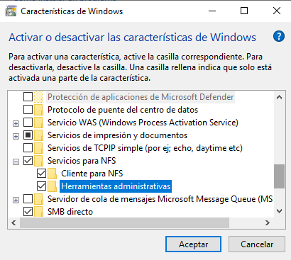
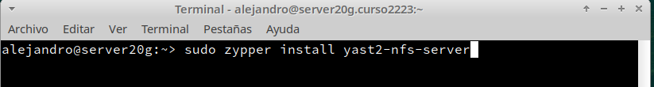
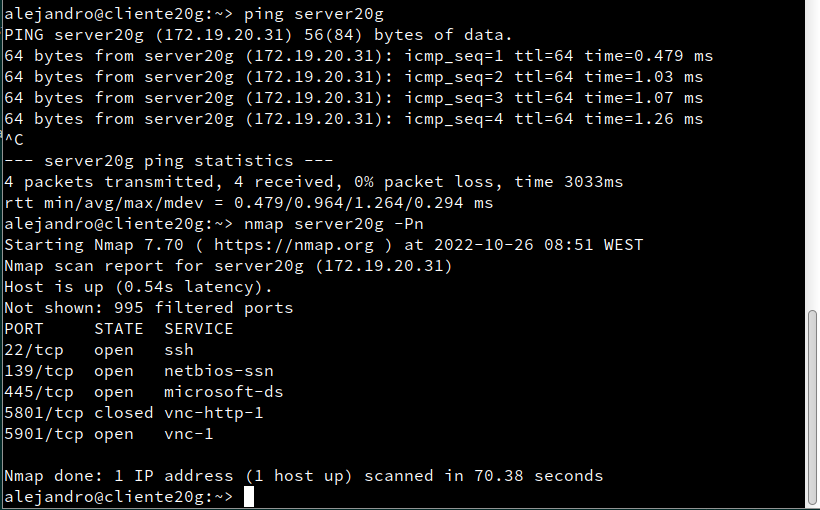
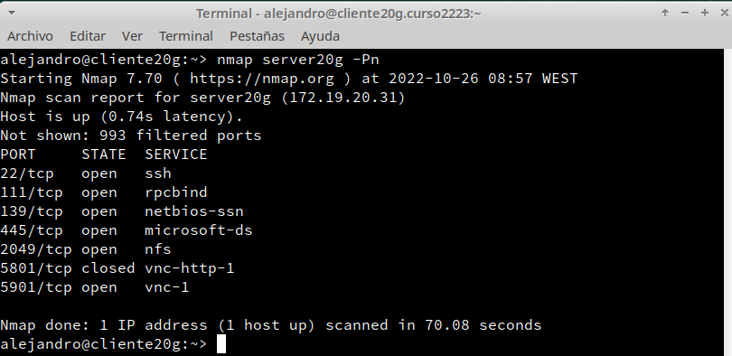

```
Nombre      : Alejandro de Paz Hernández

```

# NFS (Network File System)

## Introducción 

NFS es un protocolo de red que sirve para compartir recursos (directorios y archivos) por red entre máquinas, creando un entorno cliente/servidor en el que los usuarios pueden ver y, opcionalmente, almacenar y actualizar archivos de forma remota.

# 1. Servidor NFS Windows

## 1.1 Instalación del servicio NFS

Vamos a la MV con Windows 2016 Server:

* Agregar rol `Servidor de Archivos` y marcamos `Servicio para NFS`.

    

    

* Una vez terminada la instalación, ejecutamos lo siguiente desde PowerShell:

    

## 1.2 Configurar el servidor NFS

* Vamos a crear el recurso `public`. Para ello, vamos a `Administrador del servidor -> Servicio NFS -> Recursos Compartidos`.
    
    

* Creamos la carpeta `C:\exports20\public`

    

* Le damos permiso lectura/escritura y damos acceso a todos los equipos.

    

* Repetimos el proceso para el recurso `private`, pero esta vez asignaremos un host concreto y le daremos permiso de solo lectura:

    

    

* Ejecutamos el comando `showmount -e 172.19.20.22`, para comprobar que los recursos exportados se han creado correctamente.

    

# 2. Cliente NFS

> NOTA: es necesario instalar la versión Enterprise, ya que el resto no tienen soporte para NFS.

## 2.1 Instalar el soporte cliente NFS bajo Windows

* En primer lugar vamos a instalar el componente cliente NFS para Windows.
Para ello vamos a `Panel de Control -> Programas -> Activar o desactivar características de Windows`.

    

* A continuación, iniciamos el servicio.

    

## 3.2 Montando el recurso

Ahora necesitamos montar el recurso remoto para poder trabajar con él.

* Consultamos desde el cliente los recursos que ofrece el servidor: `showmount -e 172.19.20.22`

    

* Montamos el recurso remoto: `mount –o anon,nolock,r,casesensitive \\172.19.20.22\public *`

    

> **Descripción de los parámetros**
>
> * anon: Acceso anónimo al directorio de red.
> * nolock: Deshabilita el bloqueo. Esta opción puede mejorar el rendimiento si sólo necesita leer archivos.
> * r: Sólo lectura. Para montar en modo lectura/escritura no usaremos este parámetro.
> * casesensitive: Fuerza la búsqueda de archivos con distinción de mayúsculas y minúsculas (similar a los clientes de NFS basados en UNIX).


* Comprobamos en el cliente los recursos montados con `net use`.

    

* `netstat -n`, para comprobar el acceso a los recursos NFS desde el cliente.

    

* Para desmontar la unidad simplemente escribimos en una consola: `umount z:`

---

# 4. SO OpenSUSE

## 4.1 Servidor NFS

* Instalamos servidor NFS por terminal:

    

* Creamos las siguientes carpetas/permisos:
    * `/srv/exports20/public`, usuario y grupo propietario `nobody:nogroup`
    * `/srv/exports20/private`, usuario y grupo propietario `nobody:nogroup`, permisos 770

    

* Vamos configurar el servidor NFS de la siguiente forma:
    * La carpeta `/srv/exports20/public`, será accesible desde toda la red en modo lectura/escritura.
    * La carpeta `/srv/exports20/private`, sea accesible sólo desde la IP del cliente, sólo en modo lectura.
* Para ello modificamos el fichero `/etc/exports` añadiendo las siguientes líneas:
    
    


* Comprobamos el estado del servicio NFS:

    

* `showmount -e localhost`, comprobamos que los recursos se han creado correctamente:

    

# 5. Cliente NFS

Ahora vamos a comprobar que las carpetas del servidor son accesibles desde el cliente.
Normalmente el software cliente NFS ya viene preinstalado pero si tuviéramos que instalarlo en
OpenSUSE:
* `zypper search nfs`, para buscar los paquetes nfs.
* `zypper install nfs-client`, para instalar el paquete cliente.

## 5.1 Comprobar conectividad desde cliente al servidor

* `ping 172.19.20.31`: Comprobamos la conectividad del cliente con el servidor>:

    

* Ejecutamos los siguientes comandos en el servidor, para habilitar el firewall:

    

* Comprobamos que el servicio NFS ahora sí tiene un puerto abierto:

    

## 5.2 Montar y usar cada recurso compartido desde el cliente

Vamos al equipo cliente.
* Creamos las carpetas:
    * `/mnt/remoto20-2/public`
    * `/mnt/remoto20-2/private`


* `showmount -e 172.19.20.31`, para consultar los recursos que exporta el servidor.

    

* Montamos cada recurso compartido en su directorio local correspondiente:

    

* Comprobamos que se han montado correctamente con `df -hT`:

    

Probamos a crear ficheros y directorios en los recursos montados:

* Vemos que en `public` tenemos permisos de escritura: 

    

* Sin embargo, en `private` solo tenemos permisos de lectura:

    

* `netstat -ntap`, para comprobar el acceso a los recursos NFS desde el cliente.

    


## 5.3 Montaje automático

> Acabamos de acceder a recursos remotos, realizando un montaje de forma manual (comandos mount/umount).
Si reiniciamos el equipo cliente, podremos ver que los montajes realizados de forma manual
ya no están. Si queremos volver a acceder a los recursos remotos debemos repetir el proceso,
a no ser que hagamos una configuración permanente o automática.

* Vamos a configurar el montaje autoḿatico del recurso compartido `public`. Para
ello, vamos utilizar Yast. Nos vamos a `Yast -> Particionador -> NFS -> Añadir`:

    

* Si consultamos el contenido del fichero `/etc/fstab`, vemos que se ha añadido lo siguiente:

* Reiniciamos el equipo y comprobamos que se monta el recurso remoto automáticamente:

    

# 6. Preguntas

* ¿Nuestro cliente GNU/Linux NFS puede acceder al servidor Windows NFS? Comprobarlo.

Sí, puede. Podemos ver los recursos y montarlos:

    

    

* ¿Nuestro cliente Windows NFS podría acceder al servidor GNU/Linux NFS? Comprobarlo.

Sí, al igual que en el caso anterior, también se puede:

    

    
