```
Nombre      : Alejandro de Paz Hernández
```

---


# Servidor de Impresión GNU/Linux (CUPS)

## Introducción

Vamos a configurar un servidor de impresión en OpenSUSE utilizando la herramienta CUPS, que nos permitirá emular una impresora.

# 2. Servidor de Impresión

Lo primero es instalar el servicio. Por lo general, lo tendremos instalado por defecto. En caso contrario, podemos instalarlo con `zypper install cups`.  

* Comprobamos que el servicio se encuentra en ejecución:

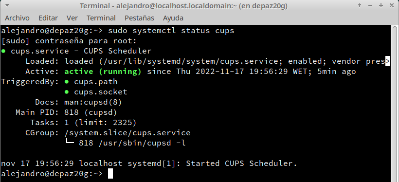

Para configurar el servicio tendremos que editar el fichero `/etc/cups/cupsd.conf` añadiendo un `Allow @LOCAL` dentro de cada `<location> </location>`. Esto nos permitirá acceso al servicio de impresión desde cualquier equipo que esté dentro de la red local. También tendremos que añadir un '*' en la sentencia `listen`, para que escuche peticiones de cualquier equipo:

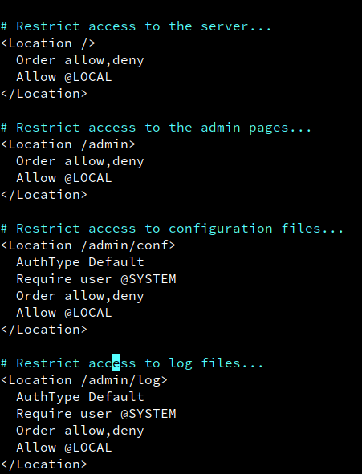

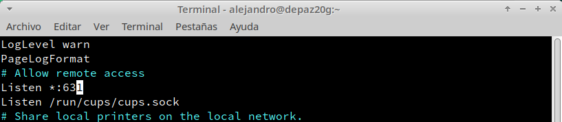

* Reiniciamos el servicio para que lea los cambios realizados en el fichero.

* A continuación, habilitamos el acceso al servicio de impresión `ipp`. Para saber en qué zona hacerlo, ejecutamos `firewall-cmd --get-default-zone`, que nos dirá qué zona se está usando por defecto:

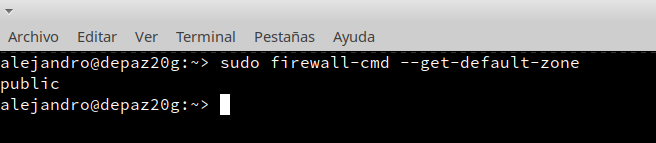

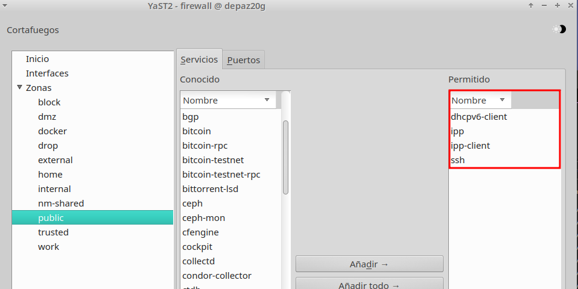

* Una vez configurado, accedemos desde un navegador al servicio de impresión. Para ello, escribimos `localhost:631` en el navegador:

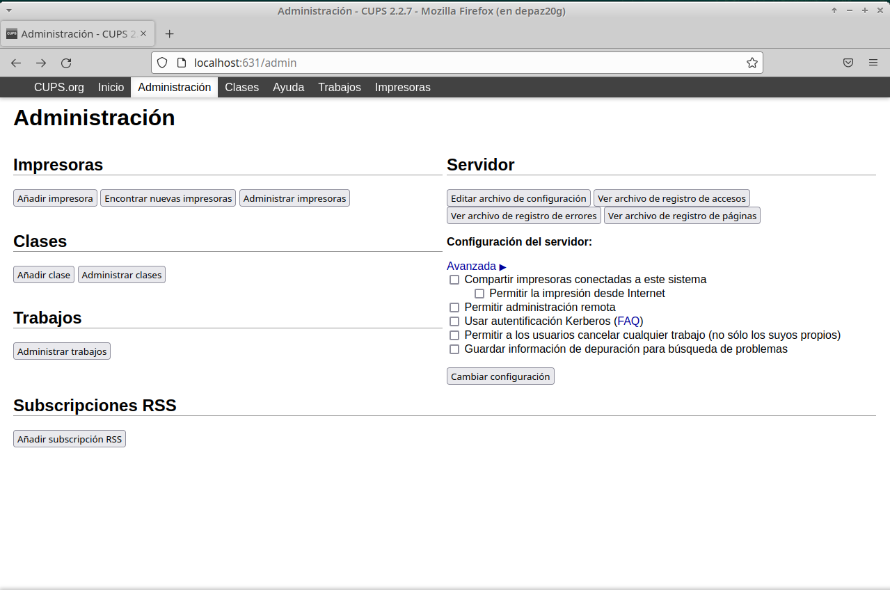

* Si queremos acceder a la sección `Ver archivo de registro de accesos` tendremos que introducir credenciales **root**:

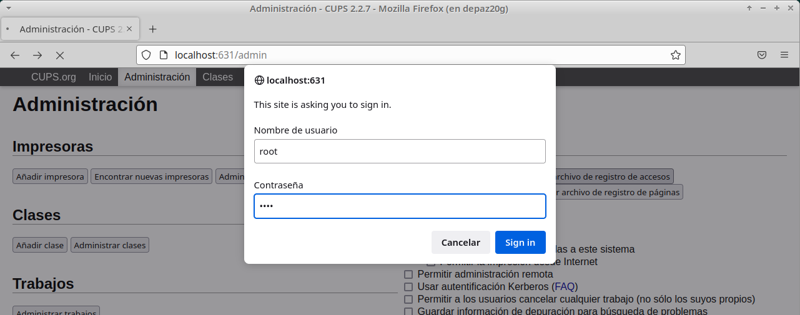

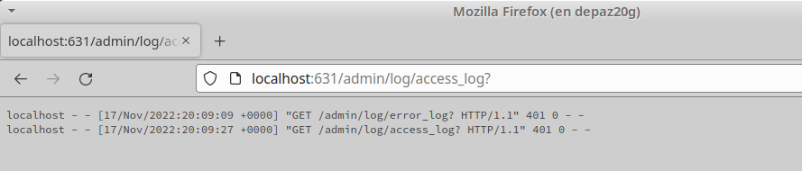

# 3. Imprimir de forma local

Ahora vamos a usar una impresora de forma local en el servidor de impresión.

* Lo primero es instalar el paquete `cups-pdf` que nos permite hacer uso de una impresora virtual PDF local:

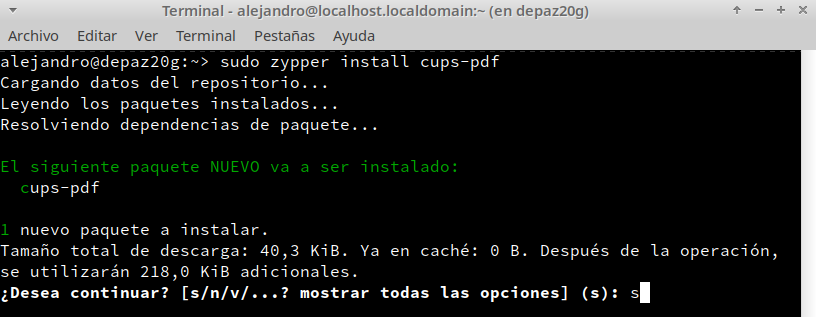

* La impresora debe estar configurada como impresora por defecto.

* Creamos un archivo "impresion20local.txt" a modo de prueba:

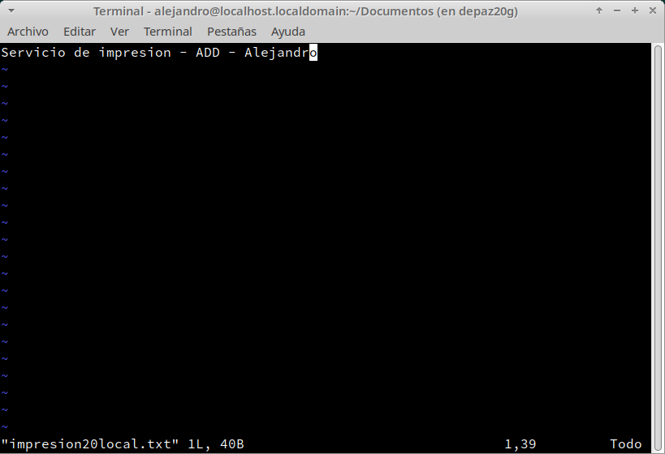

* Imprimimos el documento en la impresora local.

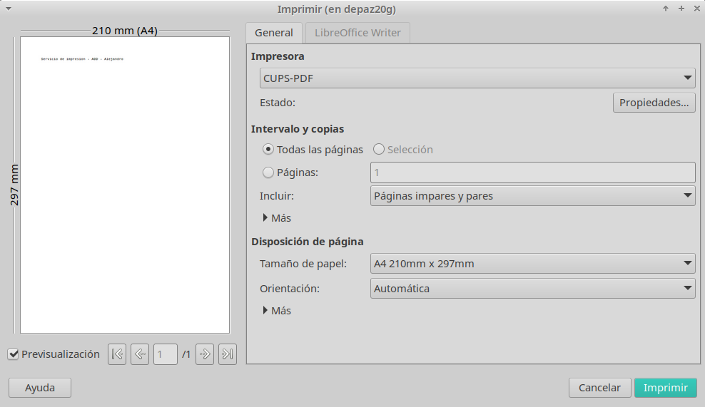

* Comprobamos el resultado. Los trabajos de impresión de la impresora virtual PDF se guardan en alguno de estos directorios:

```
/home/usuario/PDF
/var/spool/cups-pdf/anonymous
```

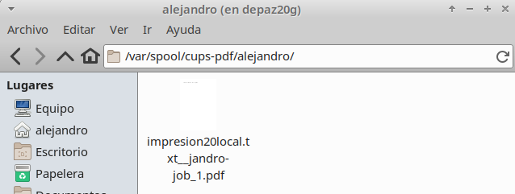

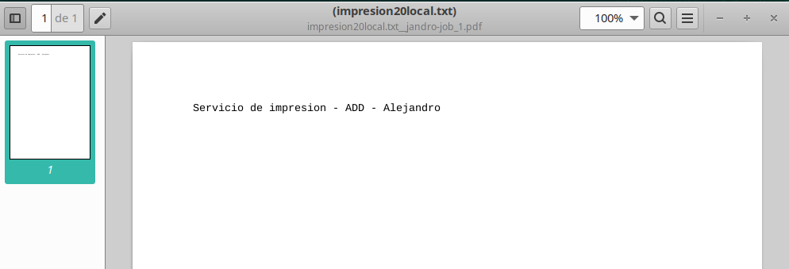

# 4. Imprimir de forma remota

Vamos a imprimir un fichero desde otra máquina OpenSUSE utilizando el servidor de impresión.

* Vamos al servidor y habilitamos la impresora como recurso de red compartido (lo podemos hacer desde `localhost:631` en el navegador, en la sección `Administración`):

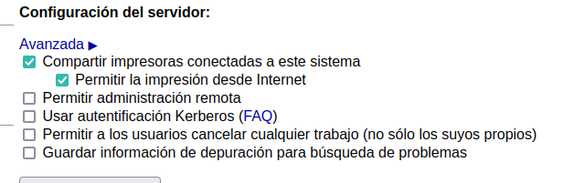


Vamos al cliente.

* Al igual que en el servidor, comprobamos qué zona se está utilizando en el cortafuegos y añadimos el servicio de impresión `ipp` a la lista de permitidos:

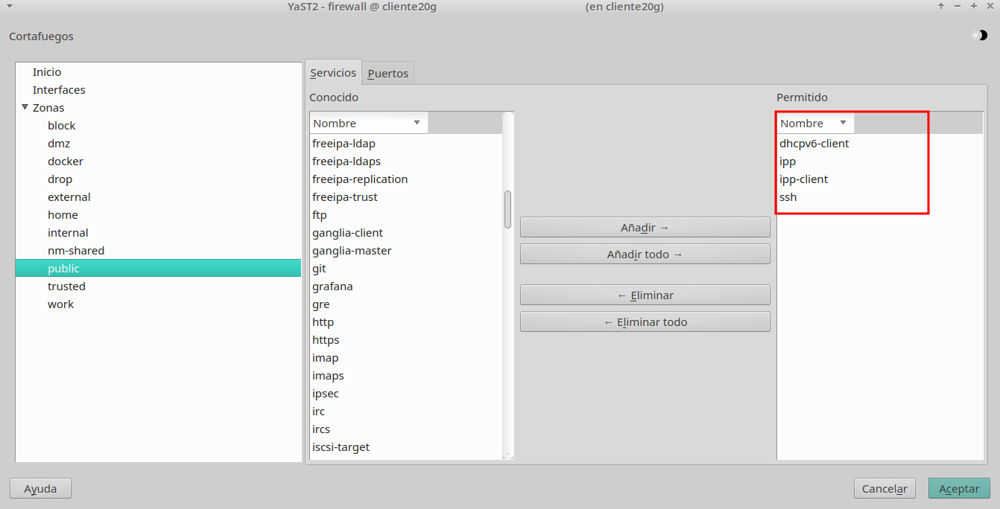

* Iniciamos la herramienta "configuración de impresión". Desbloqueamos con la clave de root y `Añadir impresora → Ingrese URL`. Al escribir la ip del servidor nos aparecerá automáticamente:

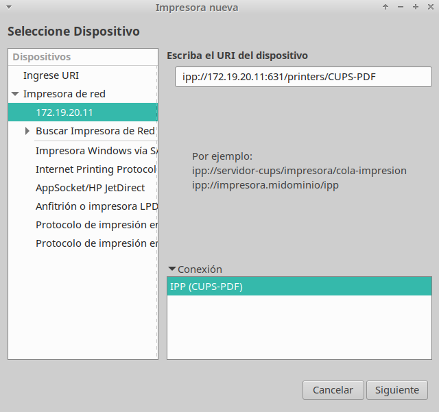

* Creamos un archivo "impresion20remota.txt" a modo de prueba:

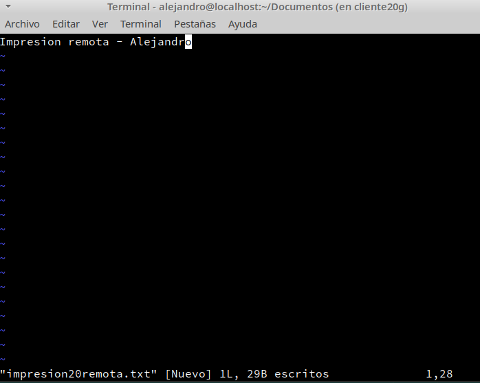

* Imprimimos el documento en la impresora remota:

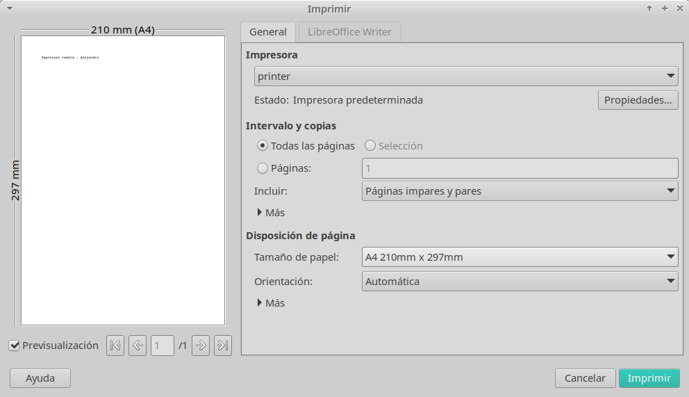

* Vamos al servidor y comprobamos:

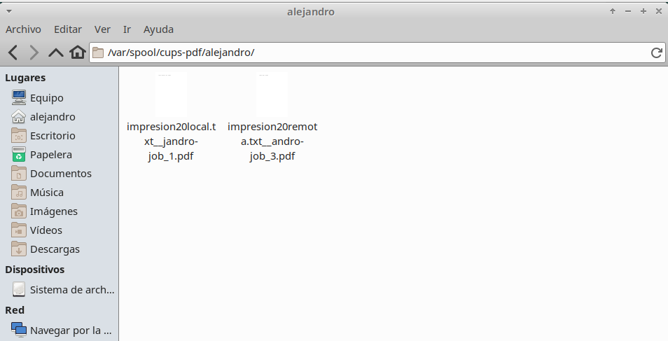

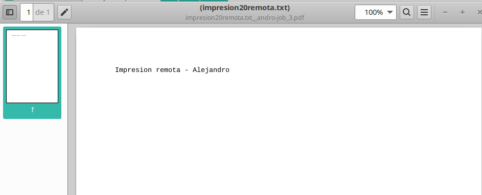


