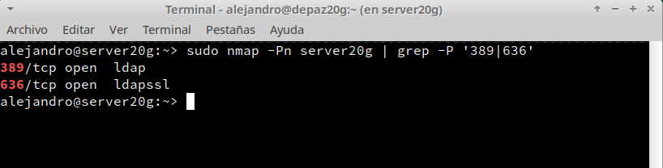

```
Nombre      : Alejandro de Paz Hernández
```

---

# Servicio de Directorio con comandos

## Introducción

LDAP (Lightweight Directory Access Protocol) es un protocolo de acceso unificado a un conjunto de información sobre los usuarios de una red de ordenadores (credenciales, datos de contacto, permisos...). Se ejecuta sobre TCP/IP o sobre otros servicios de transferencia orientados a conexión; que permite el acceso a los datos de un directorio ordenado y distribuido para buscar información.

En esta práctica, vamos a montar un servidor LDAP en una MV OpenSUSE Leap 15.4.


# 1 Nombre de equipo FQDN

* Revisamos `/etc/hostname`. Nuestra máquina debe tener un FQDN=`server20g.curso2223`.

* Revisamos `/etc/hosts`, debemos tener algo como lo siguiente:

```
127.0.0.2   server20g.curso2223   server20g
```

* Para comprobar que todo está correctamente configurado, ejecutamos los siguientes comandos:


# 2. Instalar el Servidor LDAP

Para esta práctica, configuraremos el servidor LDAP con 389-DS usando comandos.

## 2.1 Instalación del paquete

* `zypper in 389-ds`, instalamos el software LDAP.

* `rpm -qa | grep 389-ds`, comprobamos que la versión es >= 1.4.*


## 2.2 Configurar la instancia

* Creamos el fichero `/root/instance.inf` con el siguiente contenido. Este fichero sirve para configurar el servidor:


* `dscreate from-file /root/instance.inf`, creamos una nueva instancia:


* `dsctl localhost status`, comprobamos el estado actual de la instancia de la base de datos LDAP:


> NOTA: Si queremos eliminar una instancia de LDAP que ya tenemos creada haremos lo siguiente:
> * `dsctl -l`, muestra los nombres de todas las instancias.
> * `dsctl localhost stop`, para parar la instancia.
> * `dsctl localhost remove --do-it`,para eliminar la instancia.

* Creamos el fichero `/root/.dsrc` con el siguiente contenido. Este fichero sirve para configurar los permisos para acceder a la base de datos como administrador:


## 2.3 Abrir los puertos del cortafuegos

Abrimos los puertos **ldap** y **ldaps** utilizando los siguientes comandos:


## 2.4 Comprobamos el servicio

* `systemctl status dirsrv@localhost`, comprobamos si el servicio está en ejecución:


* `nmap -Pn server20g | grep -P '389|636'`, comprobamos que el servidor LDAP es accesible desde la red:



## 2.5 Comprobamos el acceso al contenido del LDAP

* `ldapsearch -b "dc=ldap20,dc=curso2223" -x | grep dn`, muestra el contenido de nuestra base de datos LDAP. "dn" significa nombre distinguido, un identificador que tiene cada nodo dentro del árbol LDAP.


* `ldapsearch -H ldap://localhost -b "dc=ldap20,dc=curso2223" -W -D "cn=Directory Manager" | grep dn`, en este caso hacemos la consulta usando usuario/clave.


# 3. Usuarios LDAP

## 3.1 Buscar Unidades Organizativas

Comprobamos que existen las Unidades Organizativas(ou) **people** y **groups**:


## 3.2 Agregar usuarios

Uno de los usos más frecuentes para el directorio LDAP es para la administración de usuarios. Vamos a utilizar ficheros **ldif** para agregar usuarios.

* Creamos el fichero `mazinger-add.ldif` con la información para crear el usuario `mazinger`:


* `ldapadd -x -W -D "cn=Directory Manager" -f mazinger-add.ldif`, para escribir los datos del fichero **ldif** anterior dentro de LDAP.


## 3.3 Comprobar el nuevo usuario

Estamos usando la clase `posixAccount`, para almacenar usuarios dentro de un directorio LDAP. Dicha clase posee el atributo `uid`. Por tanto, para listar los usuarios de un directorio, podemos filtrar por `"(uid=*)"`.

* `ldapsearch -W -D "cn=Directory Manager" -b "dc=ldap20,dc=curso2223" "(uid=mazinger)"`, para comprobar si se ha creado el usuario correctamente en el LDAP.


# 4. Agregar más usuarios

## 4.1 Agregar los siguientes usuarios

| Full name       | Account(uid) | uidNumber | Clave encriptada SHA  |
| --------------- | ------------ | --------- | --------------------- |
| Koji Kabuto     | kojikabuto         | 2002      | Contraseña encriptada |
| Boss            | boss         | 2003      | Contraseña encriptada |
| Doctor Infierno | drinfierno   | 2004      | Contraseña encriptada |

Vamos a agregar al LDAP los usuarios de la tabla, pero en este caso vamos usar
la herramienta **pwdhash** para generar las claves encriptadas dentro de los ficheros "ldif".

* Generamos las contraseñas:


* Creamos el usuario **Koji Kabuto**:


* Creamos el usuario **Boss**:


* Creamos el usuario **Doctor Infierno**:


* `ldapadd -x -W -D "cn=Directory Manager" -f nombre-fichero.ldif`, añadimos los usuarios a LDAP:


## 4.2 Comprobar desde el cliente

Vamos a la MV cliente LDAP y comprobamos.


* `nmap -Pn 172.19.20.11`, comprobamos que el puerto LDAP del servidor está abierto:


* `ldapsearch -H ldap://172.19.20.11 -W -D "cn=Directory Manager" -b "dc=ldap20,dc=curso2223" "(uid=*)" | grep dn` para consultar los usuarios LDAP que tenemos en el servicio de directorio remoto:


---
