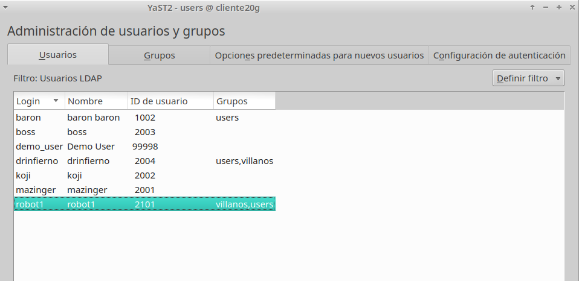

```
Nombre      : Alejandro de Paz Hernández
```

---

# Cliente para autenticación LDAP

Con autenticacion LDAP prentendemos usar la máquina servidor LDAP, como repositorio centralizado de la información de grupos, usuarios, claves, etc. Desde otras máquinas conseguiremos autenticarnos (entrar al sistema) con los usuarios definidos no en la máquina local, sino en la máquina remota con LDAP. Una especie de *Controlado de Dominio*.

En esta práctica, vamos a configurar otra MV (GNU/Linux OpenSUSE) para que podamos hacer autenticación en ella utilizando los usuarios y grupos definidos en el servidor de directorios LDAP de la máquina servidor.

# 1. Preparativos

Utilizaremos la MV Servidor de la actividad anterior, donde configuramos una instancia LDAP con varios usuarios.

Comprobamos el acceso al LDAP desde el cliente:

* `nmap -Pn 172.19.20.21 | grep -P '389|636'`, para comprobar que el servidor LDAP es accesible desde la MV2 cliente. En caso contrario revisar que el cortafuegos está abierto en el servidor y que el servicio está activo:


* `ldapsearch -H ldap://172.19.20.21:389 -W -D "cn=Directory Manager" -b "dc=ldapXX,dc=curso2021" "(uid=*)" | grep dn`, comprobamos que los usuarios del LDAP remoto son visibles en el cliente.


# 2. Configurar autenticación LDAP

## 2.1 Crear conexión con servidor

Vamos a configurar de la conexión del cliente con el servidor LDAP.

* Vamos a `Yast -> LDAP y Kerberos`. En el caso de que no nos aparezca esta herramienta, la podemos instalar con el paquete `yast2-auth-client`.
* La configuramos de la siguiente forma:


* Probamos la conexión para comprobar que la configuración es correcta y continuamos:


## 2.2 Comprobar con comandos

Desde la MV Cliente:

* Consultamos información del usuario **mazinger** y comprobamos que no es un usuario local (no está definido en `/etc/passwd`):


* Entramos con el usuario definido en **mazinger**:


# 3. Crear usuarios usando otros comandos

> Para que funcionen bien los siguientes comandos el fichero /root/.dsrc
debe estar correctamente configurado.

Vamos a la MV Servidor:

* Consultamos la lista de usuarios:


* Creamos el usuario **robot1**:


* Asignamos una contraseña a **robot1**: 


* Consultamos la lista de usuarios de nuevo para comprobar que se ha creado:


Vamos a la MV Cliente:

* Iniciamos sesión con el usuario **robot1**:


# 4. Usando Yast

## 4.1 Crear usuario LDAP usando Yast

En este punto vamos a escribir información dentro del servidor de directorios LDAP.
Este proceso se debe poder realizar tanto desde el Yast del servidor, como desde el Yast
del cliente.

Desde la MV Cliente:

* Editamos el fichero `/etc/openldap/ldap.conf` y añadimos lo siguiente:


* Vamos a `Yast -> Gestión de Usuarios y Grupos` y `Definir filtro → Usuarios LDAP`. Iniciamos sesión como usuario anónimo, ya que si intentamos acceder como `Directory Manager` nos dará error:


* Creamos el grupo `villanos`:


* Creamos el usuario `baron`:


* Incluimos los usuarios `robot` y `drinfierno` en el grupo de `villanos`:



* Al intentar grabar los cambios nos pide que iniciemos sesión como administrador, pero esto nos da un error para el que no hemos encontrado una solución:


