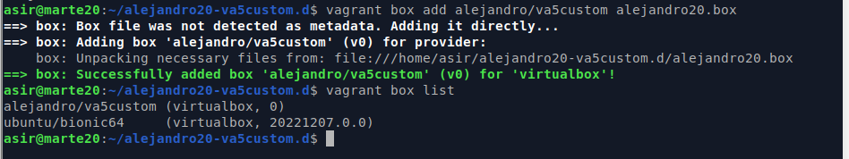

```
Nombre      : Alejandro de Paz Hernández
```

---

# Vagrant con VirtualBox

## Introducción

Vagrant es una herramienta que permite la creación de entornos virtualizados mediante comandos y ficheros de configuración. Es una herramienta muy sencilla y rápida, especialmente útil en entornos de desarrollo en los que trabajan muchas personas. Además es compatible con muchos otros entornos y herramientas de virtualización, como VirtualBox.

En esta práctica aprenderemos a utilizar Vagrant, creando varias "cajas" o máquinas con diferentes configuraciones.


## Instalar Vagrant

* Instalamos Vagrant en la máquina real.
* Comprobamos si las versiones de Vagrant y VirtualBox son compatibles con los siguientes comandos:
    


* Creamos el alias `va='vagrant'`.


# 1. Proyecto: Añadir cajas

## 1.1 Imagen, caja o box

Existen muchos repositorios desde donde podemos descargar la cajas de Vagrant (Imágenes o boxes). Incluso podemos descargarnos cajas de otros sistemas oprativos desde [VagrantCloud Box List](https://app.vagrantup.com/boxes/search?provider=virtualbox)

* Descargamos la caja que vamos a utilizar, en este caso una caja Ubuntu llamada `ubuntu/bionic64`.
* Listamos las cajas/imágenes disponibles actualmente en nuestra máquina para comprobar que se ha descargado:


## 1.2 Directorio

* Creamos un directorio para nuestro proyecto. A partir de ahora vamos a trabajar dentro de esta carpeta.

* Creamos un fichero nuevo llamado `Vagrantfile` con el siguiente contenido:


## 1.3 Comprobar

Vamos a crear una MV nueva y la vamos a iniciar usando Vagrant. Para ello, debemos estar dentro del directorio que hemos creado anteriormente.

* Iniciamos una nueva instancia de la máquina con `vagrant up`:


* Entramos en nuestra máquina virtual usando SSH:


## 1.4 Eliminamos la MV

Para eliminar la MV, salimos del SSH, paramos la ejecución de la máquina y, finalmente, la destruimos:


# 3. Proyecto: Redirección de puertos

Ahora vamos a hacer otro proyecto añadiendo redirección de puertos.

## 3.1 Creamos los ficheros

En la máquina real:

* Creamos una nueva carpeta `alejandro20-va2port.d`.
* Configuramos el Vagrantfile para usar nuestra caja ubuntu y hostname = **"alejandro20-vagrant3"**.
* Configuramos el puerto 4220 del sistema anfitrión para que sea enrutado al puerto 80 del ambiente virtualizado.
* Asignamos el nombre `vagrant20-va2port` a la MV.
* Asignamos 2048 MiB de memoria RAM.


* Levantamos la máquina:


* Comprobamos que la máquina se ha creado en VirtualBox con la configuración adecuada:


## 3.2 Entramos en la MV

* Entramos en la MV a través de SSH e instalamos apache2.


## 3.3 Comprobar

Para confirmar que hay un servicio a la escucha en el puerto 4220:

* Vamos a la máquina real y comprobamos la redirección de puertos de la máquina Vagrant.


## 3.4 Eliminar la MV


# 4. Proyecto: Suministro mediante shell script

Una de los mejores aspectos de Vagrant es el uso de herramientas de suministro. Esto es, ejecutar *"una receta"* o una serie de scripts durante el proceso de arranque del entorno virtual para instalar, configurar y personalizar un sin fin de aspectos del SO del sistema anfitrión.

## 4.1 Crear ficheros

Ahora vamos a suministrar a la MV un pequeño script para instalar Apache. 

Creamos la siguiente estructura dentro del directorio de nuestro proyecto:


* En la carpeta `html` creamos el fichero `html/index.html` con el siguiente contenido:


* Creamos el script `install_apache.sh`, dentro del proyecto con el siguiente
contenido:


## 4.2 Vagrantfile

Creamos un fichero vagrantfile con el siguiente contenido:


## 4.3 Comprobamos

* Creamos la MV con `vagrant up`. Comprobamos que, al levantar la máquina, se ejecuta el script con la instalación de apache:


* Para verificar que efectivamente el servidor Apache ha sido instalado e iniciado, abrimos navegador en la máquina real con URL `http://127.0.0.1:4220`.


# 5. Proyecto: Suministro mediante Puppet

Puppet es un orquestador. Sirve para aprovisionar las máquinas locales o remotas sin usar scripting.

## 5.1 Preparativos

* Creamos el directorio `alejandro20-va5puppet.d` como nuevo proyecto Vagrant.
* Modificamos el VagrantFile anterior y le añadimos el suministro mediante Puppet:


> Cuando usamos `config.vm.provision "shell", inline: '"echo "Hola"'`, se ejecuta directamente el comando especificado en la MV. Es lo que llamaremos provisión inline.

* Creamos la carpeta `manifests` y el fichero `manifests/alejandro20.pp` con el siguiente contenido:


## 5.2 Comprobamos

* Creamos la máquina:


* Entramos en la máquina por SSH y comprobamos que el software se ha instalado:


# 6. Proyecto: Caja personalizada

En los apartados anteriores hemos descargado una caja/box de un repositorio de Internet y la hemos personalizado. En este apartado vamos a crear nuestra propia caja/box a partir de una MV de VirtualBox que tengamos.

## 6.1 Preparar la MV VirtualBox

### Elegir una máquina virtual

Lo primero que tenemos que hacer es preparar nuestra máquina virtual con una determinada configuración para poder publicar nuestro Box.

* Vamos a utilizar una máquina GNU/Linux OpenSuse Leap 15.3.
* Configuramos la red en modo automático o dinámico (DHCP).
* Instalamos OpenSSH Server en la MV.


### Crear usuario con acceso SSH

Vamos a crear el usuario `vagrant`. Esto lo hacemos para poder acceder a la máquina virtual por SSH desde fuera con este usuario. Y luego, a este usuario le agregamos una clave pública para autorizar el acceso sin clave desde Vagrant. Veamos cómo:

* Vamos a la MV de VirtualBox.
* Creamos el usuario `vagrant`en la MV.
* Poner clave "vagrant" al usuario vagrant.
* Poner clave "vagrant" al usuario root.


* Configuramos acceso por clave pública al usuario `vagrant`:
    * `mkdir -pm 700 /home/vagrant/.ssh`, creamos la carpeta de configuración SSH.
    * `wget --no-check-certificate 'https://raw.github.com/mitchellh/vagrant/master/keys/vagrant.pub' -O /home/vagrant/.ssh/authorized_keys`, descargamos la clave pública.
    * `chmod 0600 /home/vagrant/.ssh/authorized_keys`, modificamos los permisos de la carpeta.
    * `chown -R vagrant /home/vagrant/.ssh`, modificamos el propietario de la carpeta.


## Sudoers

Tenemos que conceder permisos al usuario `vagrant` para que pueda hacer tareas privilegiadas como configurar la red, instalar software, montar carpetas compartidas, etc. Para ello debemos configurar el fichero `/etc/sudoers` (Podemos usar el comando `visudo`) para que no nos solicite la password de root, cuando realicemos estas operaciones con el usuario `vagrant`.

* Añadimos `vagrant ALL=(ALL) NOPASSWD: ALL` al fichero de configuración `/etc/sudoers`.


**Añadir las VirtualBox Guest Additions**

* Debemos asegurarnos que tenemos instalado las VirtualBox Guest Additions con una versión compatible con el host anfitrión. Comprobamos:


* Apagamos la MV.

## 6.2 Crear caja Vagrant

Una vez hemos preparado la máquina virtual ya podemos crear el box.

* Vamos a crear una nueva carpeta `alejandro20-va5custom.d` para este nuevo proyecto vagrant.
* Nos aseguramos que la MV de VirtualBox que vamos a utilizar está apagada.
* `vagrant package --base opensSUSE-client --output alejandro20.box`, parar crear nuestra propia caja a partir de la MV que hemos preparado.
* Comprobamos que se ha creado el fichero `alejandro20.box` en el directorio donde hemos ejecutado el comando.


* `vagrant box add alejandro/va5custom alejandro20.box`, añadimos la nueva caja creada por nosotros al repositorio local de cajas vagrant de nuestra máquina.
* Consultamos ahora la lista de cajas Vagrant disponibles:



## 6.3 Vagrantfile

* Creamos un fichero vagrantfile para crear la MV con el siguiente contenido:


## 6.4 Usar la nueva caja

* Levantamos una nueva MV a partir del Vagranfile.
* Nos conectamos mediante SSH.


# 7. Caja Windows

## 7.1 Windows con vagrant

* Vamos a crear una MV Windows con Vagrant. Para ello, lo primero será buscar una caja en [VagrantCloud Box List](https://app.vagrantup.com/boxes/search?provider=virtualbox). Elegimos una caja Windows y la descargamos en la máquina real:


* Creamos el Vagrantfile:


* Para poder crear la MV, debemos asegurarnos de tener los plugins de vagrant `winrm` y `winrm-elevated` instalados. En caso de tener que instalarlos, utilizaremos lo siguiente: `vagrant plugin install winrm` y `vagrant plugin install winrm-elevated`.

* Creamos la máquina y nos conectamos por SSH.


## 7.2 Limpiar

Cuando terminemos la práctica, ya no nos harán falta las cajas (boxes) que tenemos cargadas en nuestro repositorio local. Por tanto, podemos borrarlas para liberar espacio en disco:

* `vagrant box list`, para consultar las cajas disponibles.
* `vagrant box remove BOXNAME`, para eliminar una caja BOXNAME de nuestro repositorio local.
