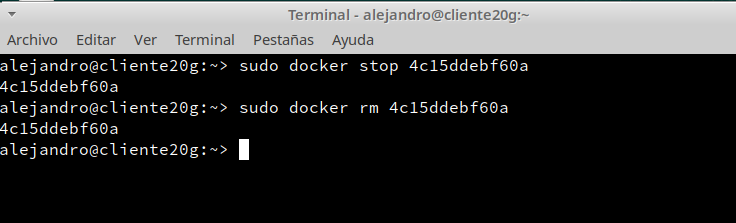

```
Nombre      : Alejandro de Paz Hernández
```

# 1. Introducción

Es muy común que nos encontremos desarrollando una aplicación, y llegue el momento que decidamos tomar todos sus archivos y migrarlos, ya sea al ambiente de producción, de prueba, o simplemente probar su comportamiento en diferentes plataformas y servicios.

Para este tipo de situaciones existen herramientas que nos facilitan el embalaje y despliegue de la aplicación, es aquí donde entra en juego los contenedores (Por ejemplo Docker o Podman).

Estas herramientas nos permite crear "contenedores", que son aplicaciones empaquetadas auto-suficientes, muy livianas, capaces de funcionar en prácticamente cualquier ambiente, ya que tiene su propio sistema de archivos, librerías, terminal, etc.

Docker es una tecnología contenedor de aplicaciones construida sobre LXC.

## 1.1 Instalación

Como usuario root:

* Instalamos Docker (`zypper in docker`) y lo iniciamos (`systemctl start docker`):


* `cat /proc/sys/net/ipv4/ip_forward`, consultamos el estado de IP_FORWARD. Debe estar activo=1.  


## 1.2 Primera prueba

Como usuario root:

* Incluimos al usuario **alejandro** como miembro del grupo `docker`. Solamente los usuarios dentro del grupo `docker` tendrán permiso para usarlo.
* `id alejandro`, para comprobar que pertenece al grupo `docker`.


Como usuario normal:

* `docker version`, comprobamos que se muestra la información de las versiones cliente y servidor.


* `docker run hello-world`, este comando hace lo siguiente:
    * Descarga una imagen "hello-world"
    * Crea un contenedor y ejecuta la aplicación que hay dentro.


* `docker images`, ahora vemos la nueva imagen "hello-world" descargada en nuestro equipo local.
* `docker ps -a`, vemos que hay un contenedor en estado 'Exited'.


* `docker stop IDContainer`, parar el conteneder identificado por su IDContainer. Este valor lo obtenemos tras consultar la salida del comando anterior (docker ps -a).
* `docker rm IDContainer`, eliminar el contenedor.



Hemos comprobado que Docker funciona correctamente.

## 1.3 Alias

Para ayudarnos a trabajar de forma más rápida con la línea de comandos podemos agregaremos `alias d='docker'` a nuestro fichero `$HOME/.alias`.

Ahora `d ps` equivale a `docker ps`.

# 2. Creación manual de nuestra imagen

Nuestro SO base es OpenSUSE, pero vamos a crear un contenedor Debian,
y dentro instalaremos Nginx.

## 2.1 Crear un contenedor manualmente

**Descargar una imagen**

* `docker search debian`, buscamos en los repositorios de Docker Hub contenedores con la etiqueta `debian`.
* `docker pull debian`, descargamos una imagen en local.
* `docker images`, comprobamos que se ha descargado.


**Crear un contenedor**: Vamos a crear un contenedor con nombre `app1debian` a partir de la imagen `debian`, y ejecutaremos el programa `/bin/bash` dentro del contendor:
* `docker run --name=app1debian -i -t debian /bin/bash`


| Parámetro  | Descripción |
| ---------- | ----------- |
| docker run | Crea un contenedor y lo pone en ejecución |
| -name      | Nombre del nuevo contenedor |
| -i         | Abrir una sesión interactiva |
| -t         | Imagen que se usará para crear el contenedor |
| /bin/bash  | Es la aplicación que se va a ejecutar |


## 2.2 Personalizar el contenedor

Ahora estamos dentro del contenedor, y vamos a personalizarlo a nuestro gusto:

**Instalar aplicaciones dentro del contenedor**

* Realizamos una actualización de paquetes con `apt update`:


* Instalamos nginx (`apt install nginx`) y el editor nano (`apt install nano`)

**Creamos un fichero HTML** `holamundo1.html`.

```
root@IDContenedor:/# echo "<p>Hola Alejandro</p>" > /var/www/html/holamundo1.html
```

**Creamos un script** `/root/server.sh` con el siguiente contenido:


**Recordatorio:**
* Hay que poner permisos de ejecución al script para que se pueda ejecutar (`chmod +x /root/server.sh`).
* La primera línea de un script, siempre debe comenzar por `#!/`, sin espacios.
* Este script inicia el programa/servicio y entra en un bucle, para mantener el contenedor activo y que no se cierre al terminar la aplicación.

## 2.3 Crear una imagen a partir del contenedor

Ya tenemos nuestro contenedor auto-suficiente de Nginx, ahora vamos a crear una nueva imagen que incluya los cambios que hemos hecho.

* Abrir otra ventana de terminal.
* `docker commit app1debian alejandro/nginx1`, a partir del contenedor modificado vamos a crear la nueva imagen que se llamará "alejandro/nginx1".


* `docker images`, comprobamos que se ha creado la nueva imagen


* Ahora podemos parar el contenedor, `docker stop app1debian` y
* Eliminar el contenedor, `docker rm app1debian`.


# 3. Crear contenedor a partir de nuestra nueva imagen

## 3.1 Crear contenedor con Nginx

Ya tenemos una imagen "alejandro/nginx" con Nginx preinstalado dentro.
* `docker run --name=app2nginx1 -p 80 -t alejandro/nginx1 /root/server.sh`, iniciar el contenedor a partir de la imagen anterior.

> El argumento `-p 80` le indica a Docker que debe mapear el puerto especificado del contenedor, en nuestro caso el puerto 80 es el puerto por defecto sobre el cual se levanta Nginx.

* No cierres la terminal. El contenedor ya está en ejecución y se queda esperando a que nos conectemos a él usando un navegador.
* Seguimos.

## 3.2 Comprobamos

* Abrimos una nueva terminal.
* `docker ps`, nos muestra los contenedores en ejecución. Podemos apreciar que la última columna nos indica que el puerto 80 del contenedor está redireccionado a un puerto local `0.0.0.0.:PORT -> 80/tcp`.
* Abrir navegador web y poner URL `0.0.0.0.:PORT`. De esta forma nos conectaremos con el servidor Nginx que se está ejecutando dentro del contenedor.

* Comprobar el acceso al fichero HTML. Abrir navegador web y poner URL `0.0.0.0.:PORT/holamundo1.html`.


* Paramos el contenedor `app2nginx1` y lo eliminamos.

Como ya tenemos una imagen docker con Nginx (Servidor Web), podremos crear nuevos contenedores cuando lo necesitemos.

## 3.3 Migrar la imagen a otra máquina

Podemos exportar nuestra imagen a otra máquina de la siguiente forma:

* `docker save -o alejandro.tar alejandro/nginx1`, guardamos la imagen "alejandro/nginx1" en un fichero tar.

Intercambiamos nuestra imagen exportada con la de un compañero de clase.

**Importar** imagen Docker desde fichero:
* Coger la imagen de un compañero de clase.
* Nos llevamos el tar a otra máquina con docker instalado, y restauramos.
* `docker load -i kevin21docker.tar`, cargamos la imagen docker a partir del fichero tar. 
* `docker images`, comprobamos que la nueva imagen está disponible.


* Probar a crear un contenedor (`app3tar`), a partir de la nueva imagen.


# 2. Dockerfile

Ahora vamos a conseguir el mismo resultado del apartado anterior, pero
usando un fichero de configuración. Esto es, vamos a crear un contenedor a partir de un fichero `Dockerfile`.

## 3.1 Preparar ficheros

* Creamos el directorio `/home/alejandro/docker20local` y entramos.

* Creamos un fichero `holamundo2.html` con el siguiente contenido:
```
Proyecto : docker20local
Autor    : Alejandro
Fecha    : 19-01-23
```
* Creamos el fichero `Dockerfile` con el siguiente contenido:


Descripción de los parámetros del Dockerfile:

| Parámetro  | Descripción |
| ---------- | ----------- |
| FROM       | Imagen a partir de la cual se creará el contenedor |
| MAINTAINER | Información del autor |
| RUN        | Comando que se ejeuctará dentro del contenedor |
| COPY       | Copiar un fichero dentro del contenedor |
| EXPOSE     | Puerto de contenedor que será visible desde el exterior |
| CMD        | Comando que se ejecutará al iniciar el contenedor |

> Ahora no nos hace falta el script /root/server.sh que mantenía la aplicación "despierta" porque estamos invocando (Instrucción CMD) al servidor Nginx con los parámetros "-g" y "daemon off;" que mantienen el servicio activo.

## 4.2 Crear imagen a partir del `Dockerfile`

El fichero Dockerfile contiene toda la información necesaria para construir el contenedor, veamos:

* `cd docker20local`, entramos al directorio con el Dockerfile.
* `docker build -t alejandro/nginx2 .`, construye una nueva imagen a partir del Dockerfile. OJO: el punto final es necesario.
* `docker images`, ahora debe aparecer nuestra nueva imagen.


## 4.3 Crear contenedor y comprobar

A continuación vamos a crear un contenedor con el nombre `app4nginx2`, a partir de la imagen `alejandro/nginx2`. Probaremos con:

```
docker run --name=app4nginx2 -p 8082:80 -t alejandro/nginx2
```

* El terminal se ha quedado "bloqueado" porque el comando anterior no ha terminado y lo hemos lanzado en primer plano (foreground). Vamos a abrir otro terminal.

Desde otra terminal:
* `docker ps`, para comprobar que el contenedor está en ejecución y en escucha por el puerto deseado.
* Comprobar en el navegador:


Ahora que sabemos usar los ficheros Dockerfile, vemos que es más sencillo usar estos ficheros para intercambiar con nuestros compañeros que las herramientas de exportar/importar que usamos anteriormente.

## 4.4 Usar imágenes ya creadas

El ejemplo anterior donde creábamos una imagen Docker con Nginx, pero esto se puede simplificar aún más si aprovechamos las imágenes oficiales que ya existen.

> Enlace de interés:
> * [nginx - Docker Official Images] https://hub.docker.com/_/nginx

* Crea el directorio `docker20web`. Entrar al directorio.
* Crear fichero `holamundo3.html` con:
    * Proyecto: docker20b
    * Autor: Alejandro
    * Fecha: 20-01-23
* Crea el siguiente `Dockerfile`


* Poner el el directorio `docker20b` los ficheros que se requieran para construir el contenedor.
* `docker build -t alejandro/nginx3 .`, crear la imagen.


* `docker run -d --name=app5nginx3 -p 8083:80 alejandro/nginx3`, crear contenedor. En este caso hemos añadido la opción "-d" que sirve para ejecutar el contenedor en segundo plano (background).


| Parámetro            | Descripción |
| -------------------- | ----------- |
| docker run -d        | Crea un contenedor y lo ejecuta en segundo plano |
| --name               | Nombre del nuevo contenedor |
| -p                   | Redirección de puertos |
|                      | Se expone el puerto 80 del contenedor por le puerto 8083 de la máquina anfitrión |
| alejandro/nginx3 | Imagen que se usará para crear el contenedor |

* Comprobar el acceso a "holamundo3.html".


# 5. Docker Hub

Ahora vamos a crear un contenedor "holamundo" y subirlo a Docker Hub.

## 5.1 Creamos los ficheros necesarios

Crear nuestra imagen "holamundo":

* Crear carpeta `docker20push`. Entrar en la carpeta.
* Crear un script (`holamundo20.sh`) con lo siguiente:

```
#!/bin/sh
echo "Hola Mundo!"
echo "alejandroXX"
echo "Proyecto dockerXXpush"
date
```

Este script muestra varios mensajes por pantalla al ejecutarse.

* Crear fichero Dockerfile


* A partir del Dockerfile anterior crearemos la imagen `alejandro/holamundo`:


* Comprobar que `docker run alejandro/holamundo` se crea un contenedor que ejecuta el script. Eliminar el contenedor si todo va bien.


## 5.2 Subir la imagen a Docker Hub

* Registrarse en Docker Hub.
* `docker login -u aleephdez`, para abrir la conexión:


* `docker tag alejandro/holamundo:latest aleephdez/holamundo:version1`, etiquetamos la imagen con "version1".

* `docker push aleephdez/holamundo:version1`, para subir la imagen (version1) a los repositorios de Docker.


## 5.3 Analizar y entender

Analizar y entender el siguiente Dockerfile (https://github.com/pausoft/docker)
* Explicar qué utilidad tiene y cómo lo hace.

# 6. Limpiar contene

Cuando terminamos con los contenedores, y ya no lo necesitamos, es buena idea pararlos y/o destruirlos.

* `docker ps -a`, identificar todos los contenedores que tenemos.
* `docker stop ...`, parar todos los contenedores.
* `docker rm ...`, eliminar los contenedores.


Hacemos lo mismo con las imágenes. Como ya no las necesitamos las eliminamos:

* `docker images`, identificar todas las imágenes.
* `docker rmi ...`, eliminar las imágenes.


---
