# 1. Salt-stack

Hay varias herramientas conocidas del tipo gestor de infrastructura como Puppet, Chef, Ansible y Terraform. En esta actividad vamos a practicar Salt-stack con OpenSUSE.

## 1.1 Preparativos

| Config   | MV1           | MV2          | MV3          |
| -------- | ------------- | ------------ | ------------ |
| Hostname | master20g     | minion20g    | minion20w    |
| SO       | OpenSUSE Leap 15.3    | OpenSUSE Leap 15.3    | Windows 10     |
| IP       | 172.19.20.31  | 172.19.20.32 | 172.19.20.11 |

---

# 2. Master: Instalar y configurar

Empezamos entrando en la MV1, que será la máquina servidor o Master:

* `zypper install salt-master`, instalamos el software salt-stack para el Master.

* Una vez instalado, modificamos el fichero `/etc/salt/master` para configurar nuestro Master de la siguiente forma:

* Habilitamos el inicio automático del servicio y lo iniciamos. Comprobamos que no aún no hay ningún equipo unido ni solicitudes pendientes:

---
# 3. Minion

Los Minions son los equipos que van a estar bajo el control del Master.

## 3.1 Instalación y configuración

Nos vamos a la MV2, que será la primera máquina cliente o Minion:

* `zypper install salt-minion`, instalamos el software salt-stack para el minion.

* Modificamos el fichero `/etc/salt/minion` para definir quien será nuestro Master:

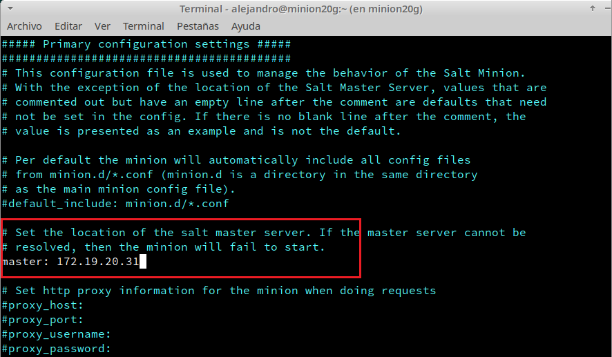

* Iniciamos el servicio y lo habilitamos para que se inicie automáticamente al arrancar la máquina:

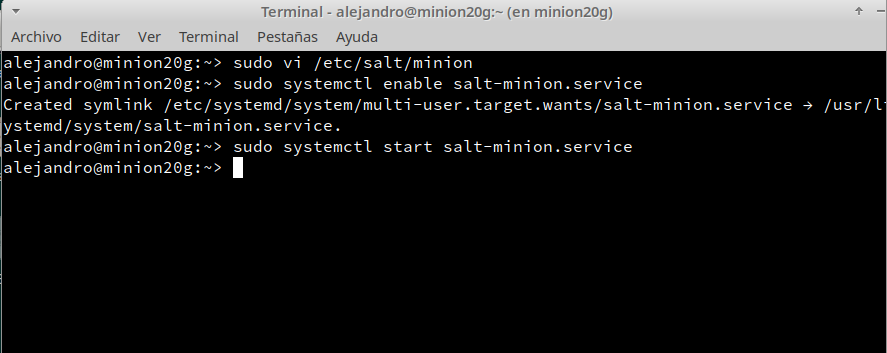

## 3.2 Cortafuegos

Hay que asegurarse de que el cortafuegos permite las conexiones al servicio Salt. Nos vamos a la MV1 Master y hacemos lo siguiente:

* `firewall-cmd --get-active-zones`, consultamos la zona de red. El resultado será public, dmz o algún otro. Sólo debe aplicar a las zonas necesarias.
* `firewall-cmd --zone=public --add-port=4505-4506/tcp --permanent`, abrimos el puerto de forma permanente en la zona "public".
* `firewall-cmd --reload`, reiniciamos el firewall para que los cambios surtan efecto.
* `firewall-cmd --zone=public --list-all`, para consultar la configuración actual la zona `public`.

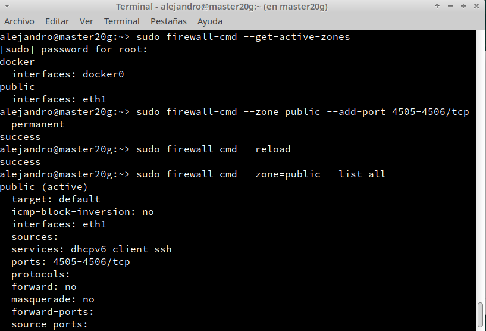

## 3.3 Aceptación desde el Master

* Comprobamos que la solicitud del Minion ha llegado al Master:

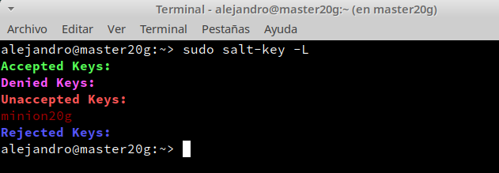

* Aceptamos la solicitud y comprobamos:

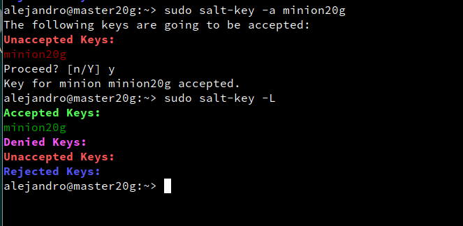

## 3.4 Comprobamos conectividad

Desde el Máster comprobamos:

1. Conectividad hacia los Minions:

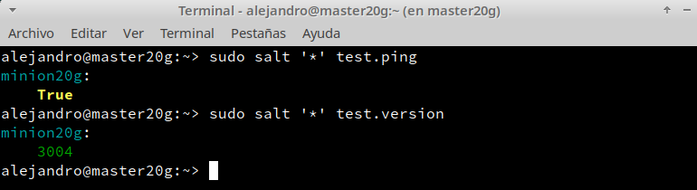

2. Versión de Salt instalada en los Minions:

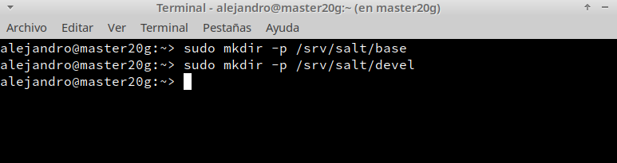

> El símbolo `'*'` representa a todos los minions aceptados. Se puede especificar un minion o conjunto de minios concretos.

---
# 4. Salt States

## 4.1 Preparar el directorio para los estados

Vamos a crear directorios para guardar lo estados de Salt. Los estados de Salt son definiciones de cómo queremos que estén nuestras máquinas.

Ir a la MV Máster:
* Creamos los directorios `/srv/salt/base` y `/srv/salt/devel`.
    * base = para guardar nuestros estados.
    * devel = para desarrollo o para hacer pruebas.

* Creamos el fichero `/etc/salt/master.d/roots.conf` con el siguiente contenido:

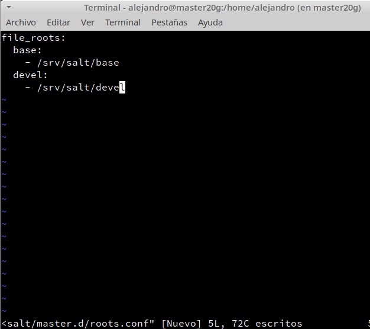

* Reiniciamos el servicio del Máster:

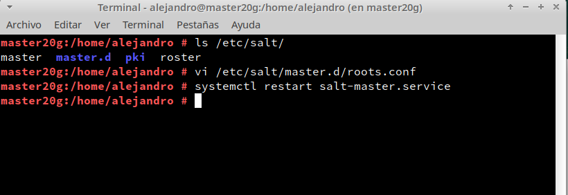

## 4.2 Crear un nuevo estado

Los estados de Salt se definen en ficheros SLS.

* Creamos el fichero `/srv/salt/base/apache/init.sls`:

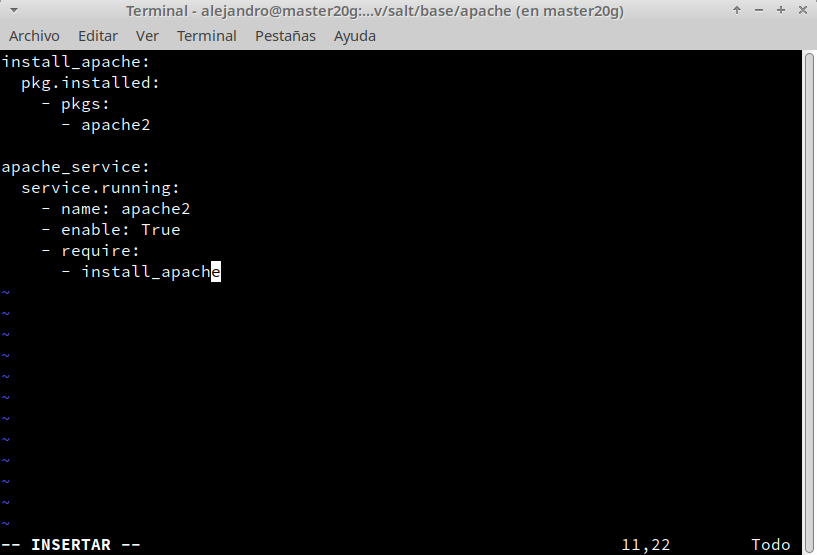

Entendamos las definiciones:
* Nuestro nuevo estado se llama `apache` porque el directorio donde están las definiciones se llama `srv/salt/base/apache`.
* La primera línea es un identificador (Por ejemplo: `install_apache` o `apache_service`), y es un texto que ponemos nosotros libremente, de forma que nos ayude a identificar lo que vamos a definir.
* `pkg.installed`: Es una orden de salt que asegura que los paquetes estén instalados.
* `service.running`: Es una orden salt que asegura de que los servicios estén iniciados o parados.

## 4.3 Asociar Minions a estados

* Creamos el fichero `/srv/salt/base/top.sls`, donde asociamos a todos los Minions con el estado que acabamos de definir.

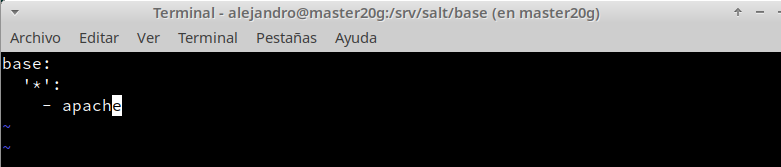

## 4.4 Comprobar: estados definidos

* Consultamos los estados que tenemos definidos para cada Minion:

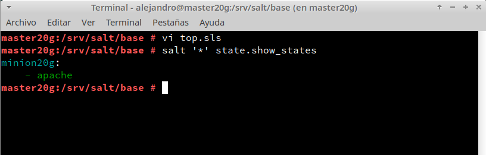

## 4.5 Aplicar el nuevo estado

Consultamos los estados en detalle y verificamos que no hay errores en las definiciones:

* `salt '*' state.show_lowstate`:

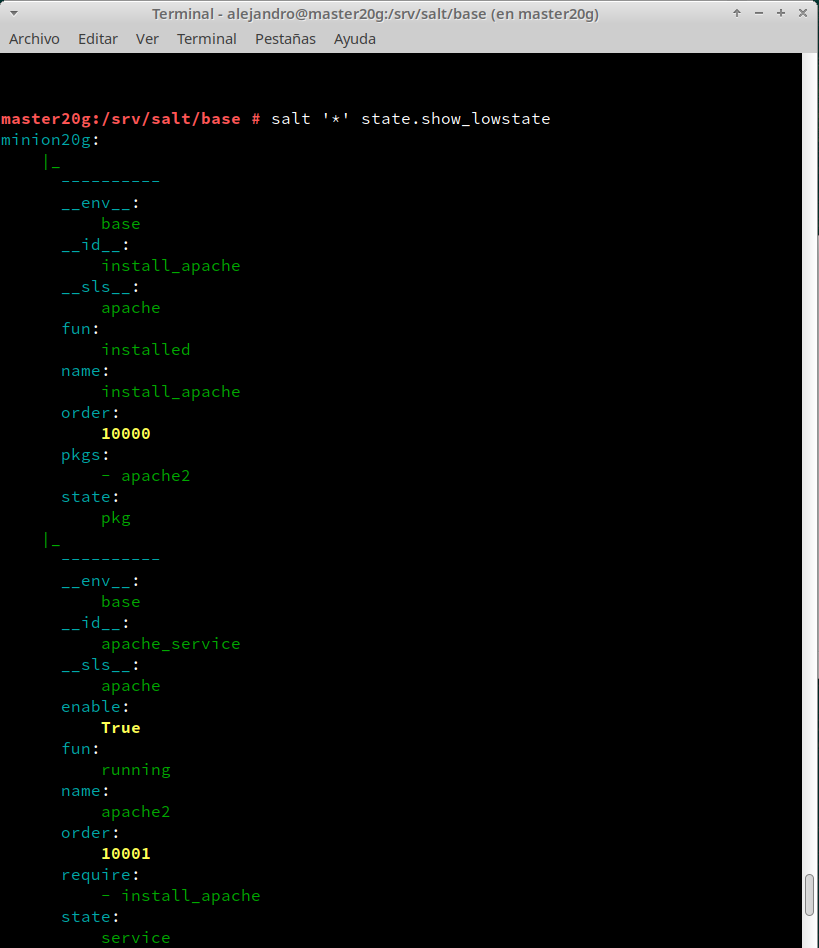

* `salt '*' state.show_highstate`:

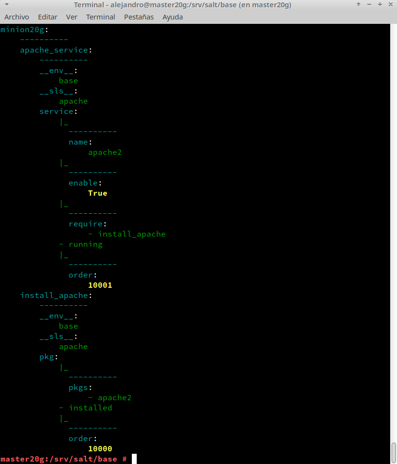

* `salt '*' state.apply apache`, para aplicar el nuevo estado en todos los minions:

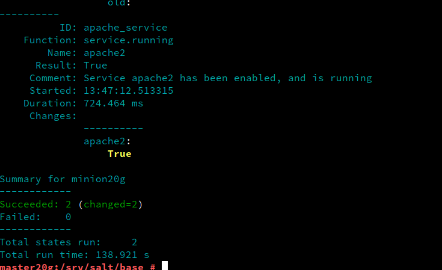

# 5. Crear más estados

## 5.1 Crear estado "users"

Vamos a crear un estado llamado `users` que nos servirá para crear un grupo y usuarios en las máquinas Minions.

* Creamos el directorio `/srv/salt/base/users`.
* Creamos el fichero `/srv/salt/base/users/init.sls` con las definiciones para crear lo siguiente:
    * Grupo `mazingerz`
    * Usuarios `koji20`, `drinfierno20` dentro de dicho grupo.
* El fichero sería algo como lo siguiente:

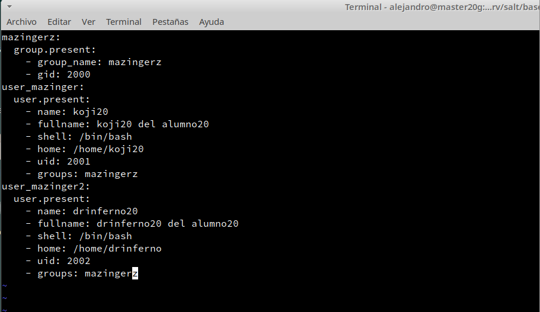

* Añadimos el estado al fichero `/srv/salt/base/top.sls`:

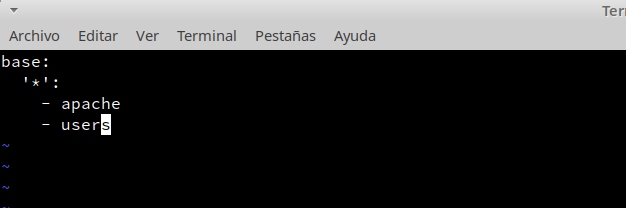

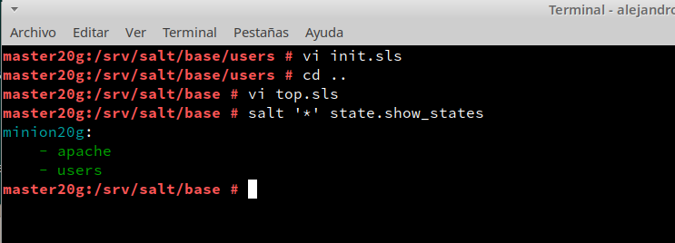

* Aplicamos el estado `users`:

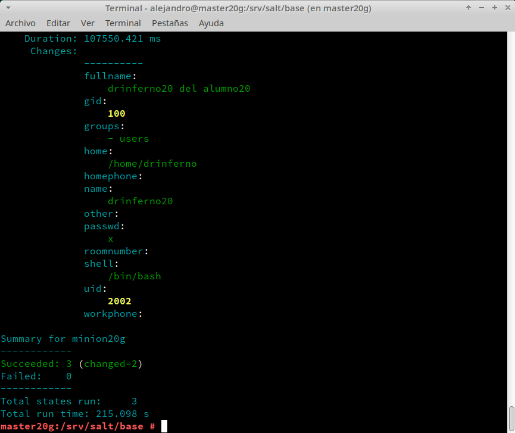

> Para este punto he omitido la parte de añadir los usuarios koji20 y drinferno20 al group mazingerz, ya que daba error y no he conseguido solucionarlo. He creado tanto el grupo como los usuarios, pero he puesto a los usuarios en el grupo **users**.

## 5.2 Crear estado "dirs"

Repetimos el proceso anterior pero esta vez haremos lo siguiente:

* Creamos un estado `dirs` para crear las carpetas `private` (700), `public` (755) y `group` (750) en el HOME del usuario `koji`:

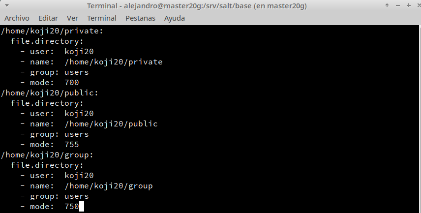

* Aplicamos el estado `dirs`:

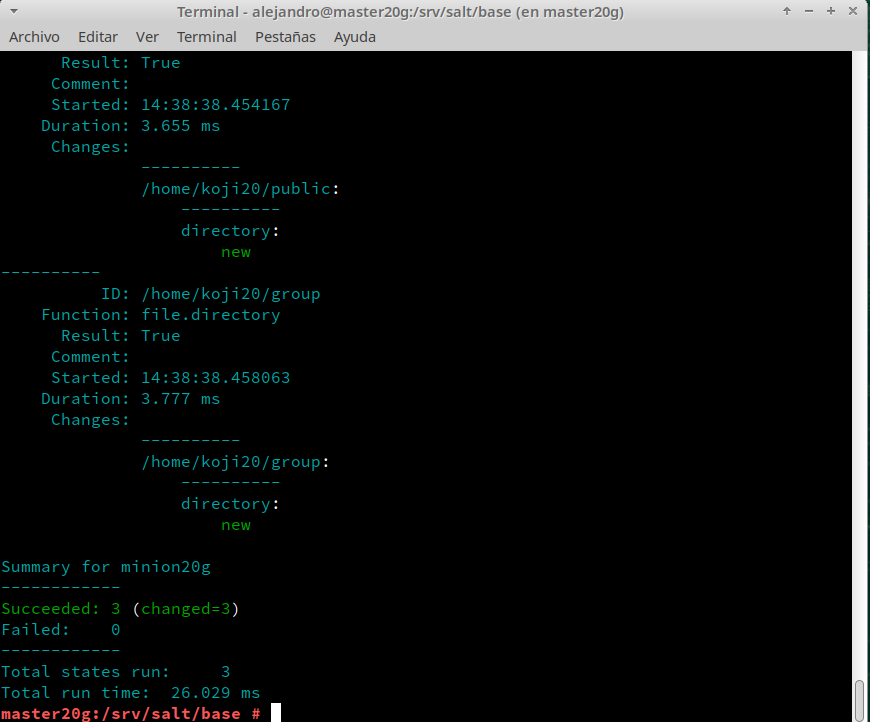

## 5.3 Ampliar estado "apache"

* Creamos el fichero `/srv/salt/base/files/holamundo.html`. Escribimos dentro nuestro nombre y la fecha actual.
* Incluimos en el estado "apache" la creación del fichero "holamundo" en el Minion. Dicho fichero se descargará desde el servidor Salt Máster y se copiará en el Minion.

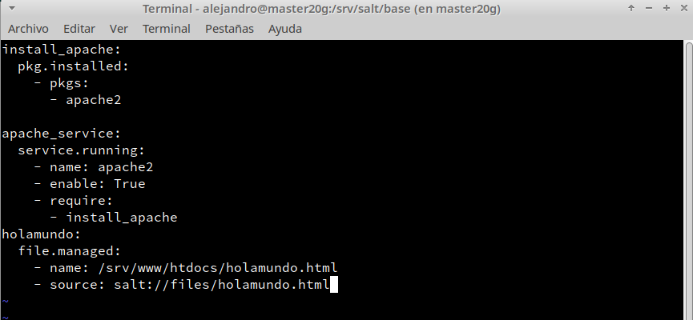

* Aplicamos el estado `apache`:

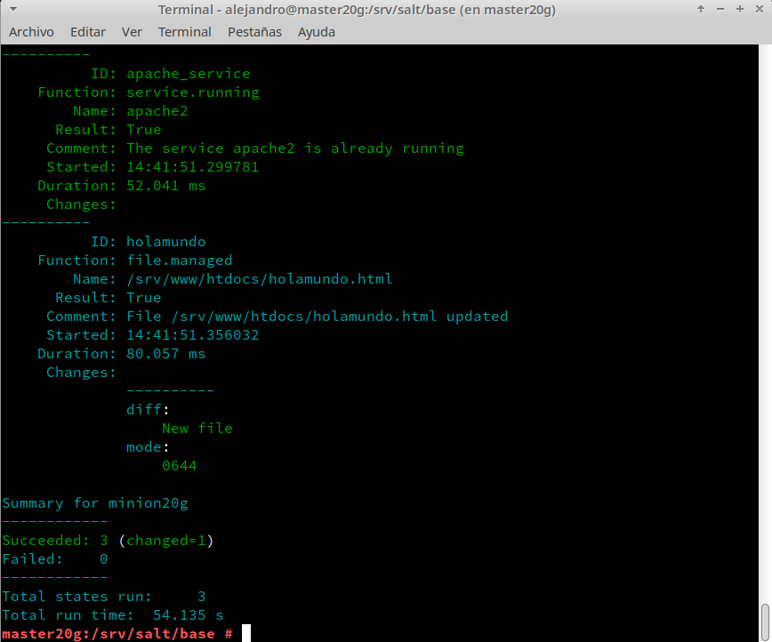

---
# 6. Añadir Minion de otro SO

## 6.1 Minion con Windows

Nos vamos a la MV3 Windows, nuestro segundo cliente/Minion:

* Instalamos `salt-minion`. Para ello, nos dirigimos a la [página oficial](https://repo.saltproject.io/) y descargamos el .exe. Lo ejecutamos y lo instalamos:

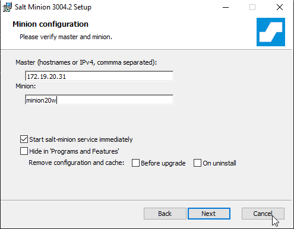

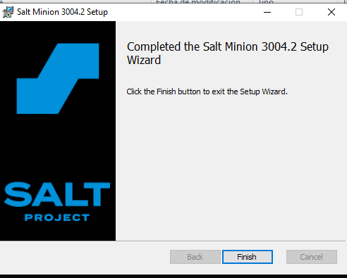

* Una vez instalado, volvemos al Master y aceptamos al Minion:

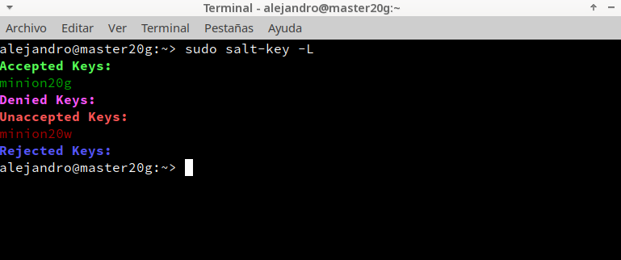

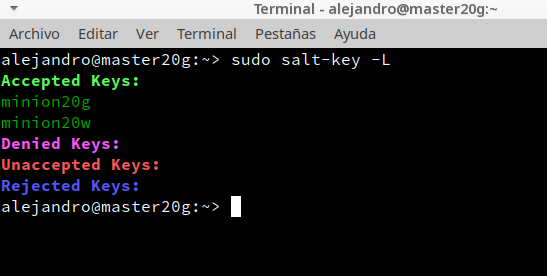

## 6.2 Aplicar estado

* Creamos un estado que cree el usuario `windows-user` y lo añada a los grupos Administradores y Usuarios:

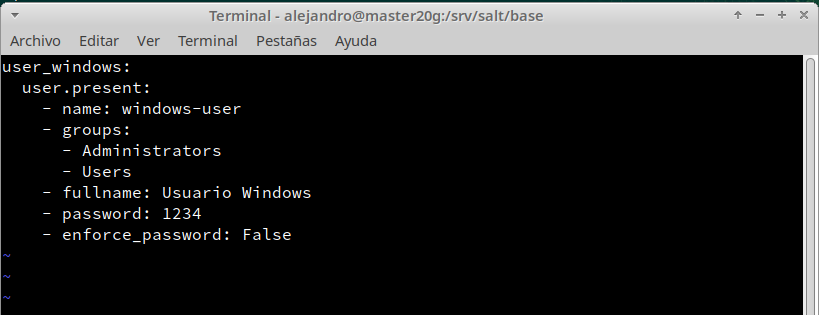

* Añadimos el estado al Minion Windows únicamente:

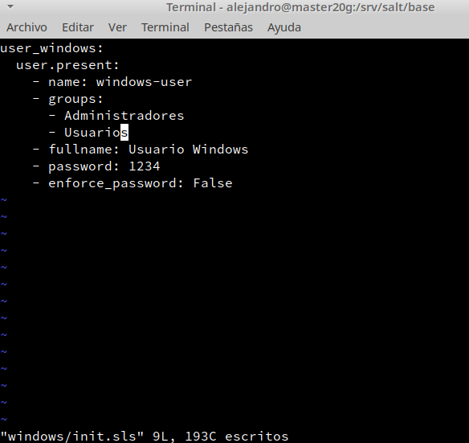

* Aplicamos el estado:

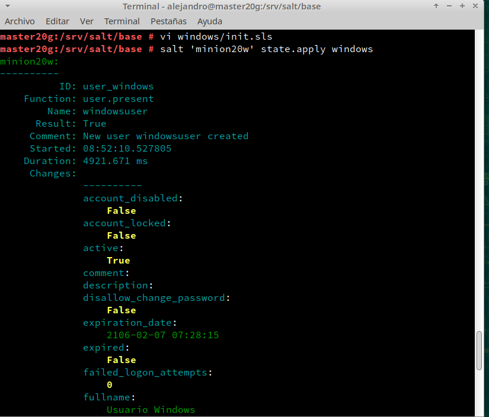

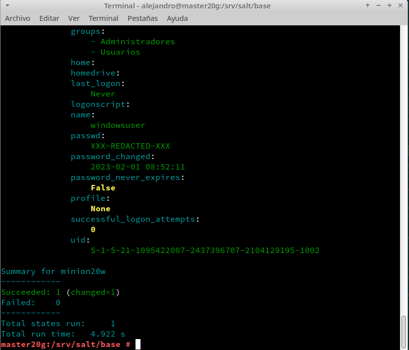

---